# TLS简介
SSL 即安全套接字层，它在 OSI 七层网络模型中处于表示层，在TCP/IP五层模型中它位于应用层，实际是位于应用层和传输层之间，SSL 在 1999 年被 IETF(互联网工程组)更名为 TLS ，即传输安全层，直到现在，TLS 一共出现过三个版本，1.1、1.2 和 1.3 ，目前最广泛使用的是 1.2，所以接下来的探讨都是基于 TLS 1.2 的版本上的。

# TLS1.2 和 TLS 1.3 的区别
在 TLS 1.2 的握手中，一般是需要 4 次握手，先要通过 Client Hello （第 1 次握手）和 Server Hello（第 2 次握手） 消息协商出后续使用的加密算法，再互相交换公钥（第 3 和 第 4 次握手），然后计算出最终的会话密钥，下图的左边部分就是 TLS 1.2 的握手过程：

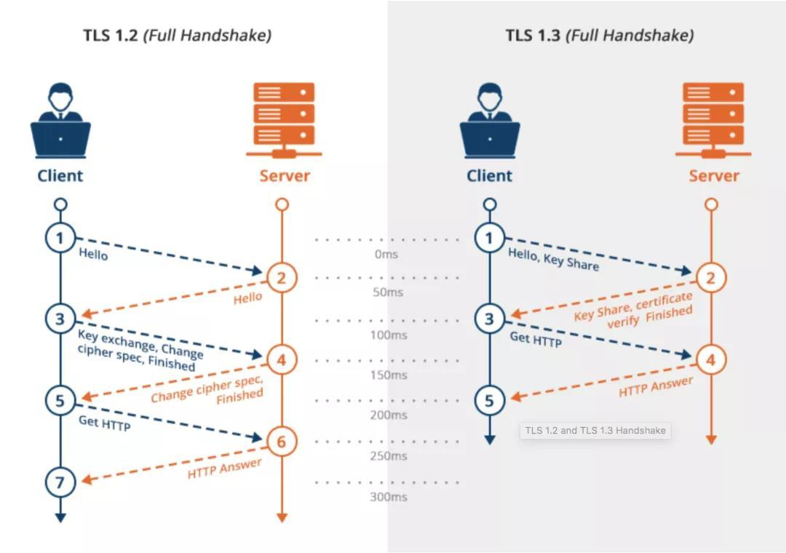

上图的右边部分就是 TLS 1.3 的握手过程，可以发现 TLS 1.3 把 Hello 和公钥交换这两个消息合并成了一个消息，于是这样就减少到只需 1 RTT 就能完成 TLS 握手。
SSL 是一个独立的协议，不只有 HTTP 可以使用，其他应用层协议也可以使用，比如 `SMTP(电子邮件协议)`、`Telnet(远程登录协议)` 等都可以使用。

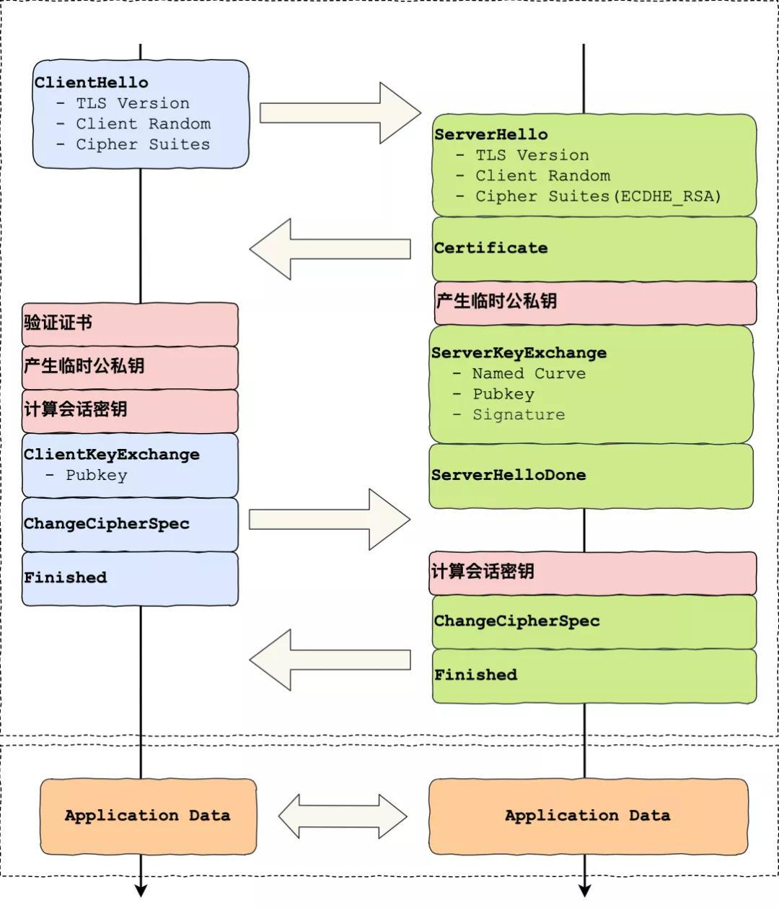

下面是客户端与服务器建立连接的完整过程，显然前三个 TCP 数据包是三次握手包。

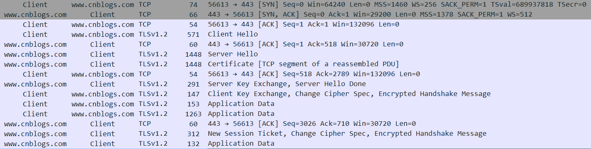

下面是只显示 TLS 协议的通信过程

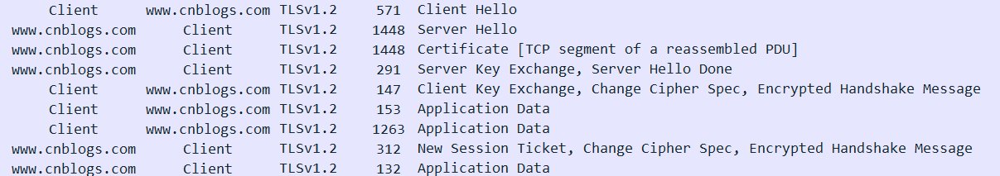

客户端发起握手协商操作，它将发送一个 ClientHello 消息给服务器，消息中明确了其所支持的SSL/TLS版本、Cipher suite 加密算法组合等，可以让服务器选择，并提供了一个客户端随机数，用于以后生成会话密钥使用。

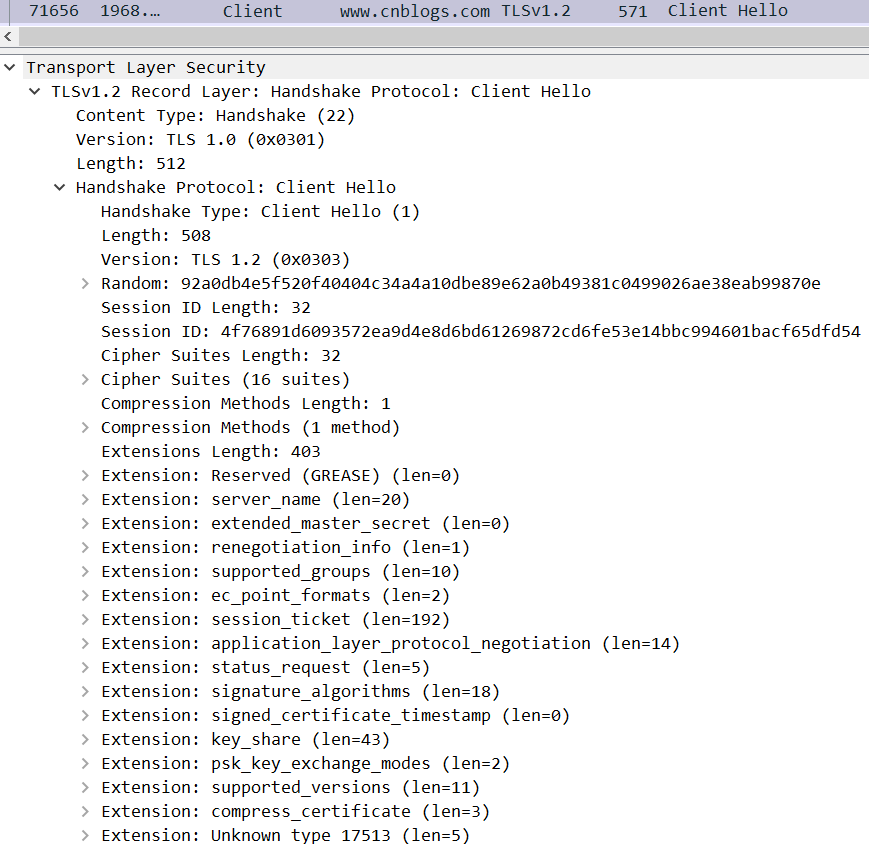

服务器将返回一个 ServerHello 消息，该消息包含了服务器选择的协议版本、加密算法，以及服务器随机数、会话ID等内容。其中，服务器选择的协议版本应小于等于客户端 ClientHello 中的协议版本。

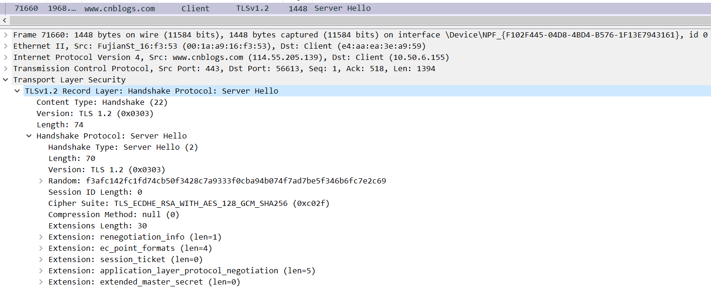

服务器发送ServerHello消息，选择好协议版本和加密算法组合后，将发送 Certificate 消息，该消息包含了服务器的证书等信息，可通过证书链认证该证书的真实性。根据选择的加密算法组合的不同，服务器证书中的公钥也可被用于加密后面握手过程中生成的 Premaster secret（预主密钥）。

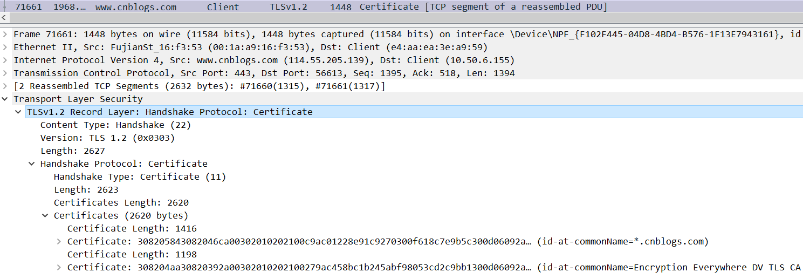

ServerKeyExchange 消息，消息中包含了服务器这边的 EC Diffie-Hellman 算法相关参数。

ServerHelloDone 消息，告知客户端服务器这边握手相关的消息发送完毕。

从数据包中可以看出这两个小时是一起发的。

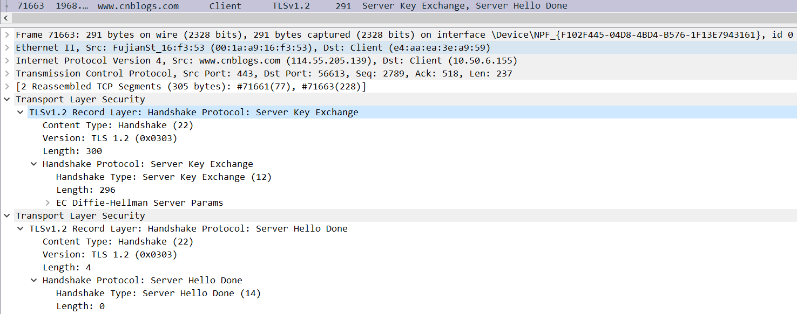

客户端发送 Client Key Exchange Change Cipher Spec 消息

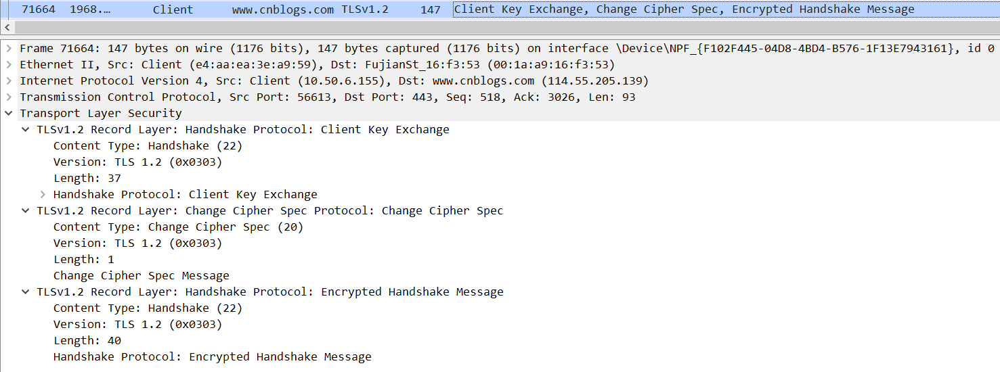

服务器发送 ChangeCipherSpec 消息，通知客户端此消息以后服务器会以加密方式发送数据。

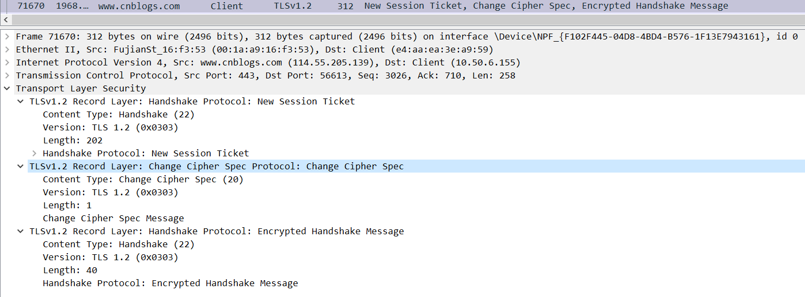

接下来的数据就都被加密了。

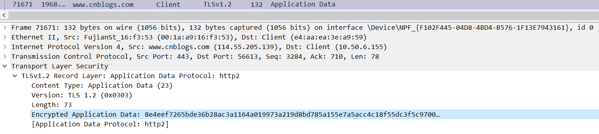

下面是 TLS 1.3 的通信过程。

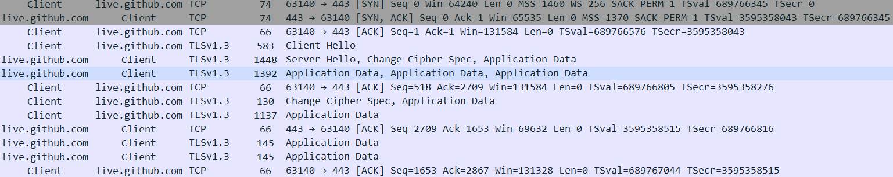