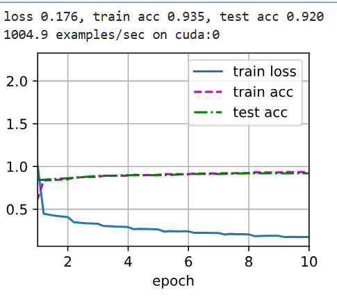

## VGG神经网络

2014年，牛津大学计算机视觉组（**V**isual **G**eometry **G**roup）和Google DeepMind公司一起研发了新的卷积神经网络，并命名为VGGNet。VGGNet是比AlexNet更深的深度卷积神经网络，该模型获得了2014年ILSVRC竞赛的第二名。

VGG 的结构与 AlexNet 类似，区别是深度更深，但形式上更加简单。VGG由5层卷积层、3层全连接层、1层softmax输出层构成，层与层之间使用maxpool（最大池化）分开，所有隐藏层的激活单元都采用ReLU函数。

下面我们以VGG11作为例子来进行讲解，VGG11总共包含11个子层，第1层卷积层由1个conv3-64（3*3大小的卷积核和64个输出通道）组成，第2层卷积层由1个conv3-128组成，第3层卷积层由2个conv3-256组成，第4层卷积层由2个conv3-512组成，第5层卷积层由2个conv3-512组成，然后是2个FC4096，1个FC1000。总共11层，这也就是VGG11名字的由来。


## VGG代码的实现

经典卷积神经网络的基本组成部分是下面的这个序列：

1. 带填充以保持分辨率的卷积层；
2. 非线性激活函数，如ReLU；
3. 池化层，如最大池化层。

而一个VGG块与之类似，由一系列卷积层组成，后面再加上用于空间下采样的最大池化层。在最初的VGG论文中作者使用了带有卷积核3x3、填充为1（保持高度和宽度）的卷积层，和带有2x2汇聚窗口、步幅为2（每个块后的分辨率减半）的最大池化层。在下面的代码中，我们定义了一个名为`vgg_block`的函数来实现一个VGG子层。

```python
import torch
from torch import nn
from d2l import torch as d2l

def vgg_block(num_convs, in_channels, out_channels):
    layers = []
    for i in range(vgg_block):
        layers.append(nn.Conv2d(in_channels, out_channels, 
                                kernel_size=3, padding=1))
        layers.append(nn.ReLU())
        in_channels = out_channels
    layers.append(nn.MaxPool2d(kernel_size=2,stride=2))
    return nn.Sequtenial(*layers)
```

再定义每一个VGG子层的卷积层个数和输出通道个数

```python
conv_arch = ((1, 64), (1, 128), (2, 256), (2, 512), (2, 512))
```

VGG11卷积神经网络的实现

```python
def vgg(conv_arch):
    conv_blocks = []
    in_channels = 1
    for num_convs, out_channels in conv_arch:
        conv_blocks.append(vgg_block(num_convs, in_channels, out_channels))
        in_channels = out_channels
    return nn.Sequential(
    *conv_blocks, nn.Flatten(), 
    nn.Linear(out_channels * 7 * 7, 4096), nn.ReLU(), 
    nn.Dropout(0.5),
    nn.Linear(4096, 4096), nn.ReLU(), 
    nn.Dropout(0.5),
    nn.Linear(4096, 10))
)

net = vgg(conv_arch)
```

接下来，我们将构建一个高度和宽度为224的单通道数据样本，以观察每个层输出的形状。

由于VGG-11比AlexNet计算量更大，因此我们构建了一个通道数较少的网络，足够用于训练Fashion-MNIST数据集。

```python
ratio = 4
small_conv_arch = [(pair[0], pair[1] // ratio) for pair in conv_arch]
net = vgg(small_conv_arch)
```

训练结果为

```python
lr, num_epochs, batch_size = 0.05, 10, 128
train_iter, test_iter = d2l.load_data_fashion_mnist(batch_size, resize=224)
d2l.train_ch6(net, train_iter, test_iter, num_epochs, lr, d2l.try_gpu())
```


