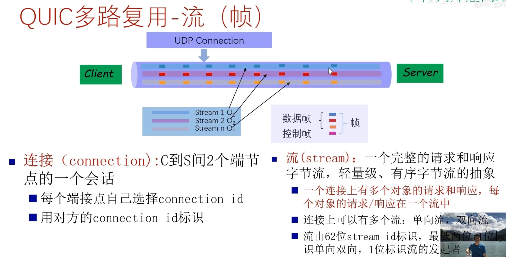

# http介绍

http全程HyperText Transfer Protocol（超文本传输协议），他是TCP/IP协议族中的一个应用层协议，遵循CS模型（即客户端服务器模型），它用于定义 Web 浏览器与 Web 服务器之间交换数据的过程以及数据本身的格式。

# http协议发展历史

## http0.9

HTTP 于 1990 年问世。那时的 HTTP 并没有作为正式的标准被建立。
现在的 HTTP 其实含有 HTTP1.0 之前版本的意思，因此被称为 HTTP/0.9。

该版本极其简单：

- 只有一个命令 GET；
- 没有 Header 等描述数据的信息；
- 服务器在发送数据完毕后，就关闭 TCP 连接。

## HTTP/1.0

HTTP/1.0 版本与 HTTP/0.9 相比，主要有：

- 支持并行连接，可以同时建立多个TCP连接

- 增加了很多命令，如 POST，PUT，HEAD；
- 增加了 Status Code 和 Header 相关内容；
- 增加了多字符集支持、多部分发送(multi-part type)、权限(authorization)、缓存(cache)、内容编码(content encoding)等。

## HTTP/1.1

HTTP/1.1 默认使用 `Connection:keep-alive`（**长连接**），避免了连接建立和释放的开销；通过 Content-Length 字段来判断当前请求的数据是否已经全部接受。不允许同时存在两个并行的响应。

- 增加了 PATCH、OPTIONS、DELETE 命令。
- 持久连接也称为（Http keep-alive）：只要任意一端没有明确提出断开连接，则保存TCP连接状态，允许在一个TCP连接上发送多个请求和响应。这样可以减少连接建立和关闭的开销，提高性能。
- 流水线机制：即在同一个 TCP 连接里面，客户端可以同时发送多个请求。例如，浏览器同时发出 A 请求和 B 请求，但是服务器还是按照顺序，先回应 A 请求，完成后再回应 B 请求。
- 虚拟主机支持：增加 Host 字段，允许在同一个IP地址上托管多个域名，并根据请求中的Host头部字段来区分不同的网站。这个字段增加的好处就是在同一个物理服务器中可以同时部署多个 Web 服务，这样可以提高物理服务器的使用效率。

- 缓存控制增强：HTTP/1.1引入了更多的缓存控制机制，例如通过Cache-Control头部字段来指定缓存的行为，以及通过ETag和If-None-Match头部字段来进行缓存验证。

- 断点续传：HTTP/1.1支持断点续传，允许客户端在下载大文件时可以从上次中断的地方继续下载，而不需要重新下载整个文件。

### 优点

- 减少了TCP连接的重复建立和断开所造成的额外开销，减去了服务器端的压力。

- 高效的网络利用率：流水线机制允许同时发送多个请求，提高了网络利用率。

- 灵活的缓存控制：HTTP/1.1引入了更多的缓存控制机制，使得缓存更加灵活和高效。

- 更高效的请求和响应处理：通过 PUT、DELETE 和 OPTIONS，可以促进对服务器上资源的细粒度控制。它还支持 HTTP 流水线和分块传输编码，从而减少发送大型有效负载的延迟。

### 缺点

- 服务器响应采用先到先服务的模式，按需响应这些请求，这样一些小的对象可能不得不等待大对象传输完毕才能传输，影响用户体验。

- 队头阻塞：由于HTTP/1.1使用单个TCP连接来发送多个请求和响应，如果某个请求或响应被阻塞或丢失，后续的请求或响应也会被阻塞。这种情况称为队头阻塞，可能导致性能下降。（网络延迟问题只要由于队头阻塞，导致宽带无法被充分利用）

- 无法处理大量并发请求：由于HTTP/1.1仍然使用单个TCP连接来处理请求和响应，当有大量并发请求时会导致服务器资源消耗过大。（巨大的Http头部）

- 明文传输不安全。

- 不支持服务器推送消息。

## HTTP/2.0

HTTP/2（超文本传输协议第2版，最初命名为HTTP 2.0），简称为h2（基于TLS/1.2或以上版本的加密连接）或h2c（非加密连接）， HTTP/2 是 HTTP 协议的第二个主要版本，用于在 Web 服务器和客户端之间传输数据。HTTP/2 是 HTTP 协议自 1999 年 HTTP 1.1 的改进版 RFC 发布后的首个更新，主要基于 SPDY 协议。多数主流浏览器已经在 2015 年底支持了该协议。HTTP/2是一种网络协议，是HTTP/1.1的升级版，由IETF在2015年发布。HTTP/2旨在提高Web性能，减少延迟，增加安全性，使Web应用更加快速、高效和可靠。

- 被请求对象的传输次序基于客户端指定的优先级（不见得是FCFS）
- 将大对象分割成frames，调度这些frames的传输次序来缓解队头阻塞

- 二进制传输：HTTP/2 使用二进制协议，与 HTTP/1.1 使用的文本协议不同。二进制协议可以更快地解析，更有效地传输数据，减少了传输过程中的开销和延迟。
- 头部压缩：HTTP/2 使用 HPACK 算法对 HTTP 头部进行压缩，减少了头部传输的数据量，从而减少了网络延迟。

- 服务器推送：HTTP/2 支持服务器推送，允许服务器在客户端请求之前推送资源，以提高性能。

- 改进的安全性：HTTP/2 默认使用 TLS（Transport Layer Security）加密传输数据，提高了安全性。

- 兼容 HTTP/1.1：HTTP/2 可以与 HTTP/1.1 共存，服务器可以同时支持 HTTP/1.1 和 HTTP/2。如果客户端不支持 HTTP/2，服务器可以回退到 HTTP/1.1。

### 缺点

- 和1.1一样浏览器可以打开多个并行的TCP连接来减少卡顿，但增加了总体吞吐量和服务器负担

- TCP以及TCP+TLS建立连接的延迟（1+2RTT握手延迟），握手次数过多，以及慢启动都是TCP的问题

- TCP的队头阻塞没有彻底解决（http2.0中，多个请求是跑在一个TCP管道中的，一旦丢包，TCP就要等待重传（丢失的包等待重新传输确认），从而阻塞该TCP连接中的所有请求）

- 基于TCP的协议，当IP地址变化时，其连接无法维持，移动性支持不好

  

4、HTTP/3.0
Google在推行SPDY的时候意识到了上述http2.0一系列问题，于是又产生了基于UDP协议的“QUIC”协议，让HTTP跑在QUIC上而不是TCP上。

将传输层协议由TCP替换为QUIC。QUIC是一个基于UDP（User Datagram Protocol，用户数据报协议）的新型传输层协议，由Google在2013年首次公开发布。QUIC旨在解决TCP的一些固有问题，如连接建立的延迟和拥塞控制算法的不足。

。

从而产生了HTTP3.0版本，它解决了队头阻塞的问题。

- HTTP/3将HTTP/2的一些好的功能挪到QUIC上，如多路复用功能（同时传输多个对象），对象分帧传输（大对象分帧交错传输），优先定义传输次序，二进制传输，头部压缩等
- 同时将部分TCP功能也挪到了QUIC，如可靠性工作，流量控制和拥塞控制，基于UDP重新的高效实现，避免TCP序号二义性，超时定时器时间计算问题。
- 1-RTT握手：首次连接时使用，仅需一次往返即可完成连接建立
- 0-RTT握手：对已连接过的服务器，可实现零往返时间的连接恢复
- 借助已有成熟先进安全协议TLS1.3，和QUIC协作关系不是包含关系，借助TLS1.3握手认证对方身份和交换密钥等
- QUIC在应用层，用户态实现，便于部署和推广。
- 连接迁移： QUIC支持快速的连接迁移，即使在网络切换或IP地址变更的情况下，连接也能够快速恢复，提高了网络的稳定性和可靠性。
  

[HTTP头部详解：从基础到实战-CSDN博客](https://blog.csdn.net/qqww22884455/article/details/148214787)