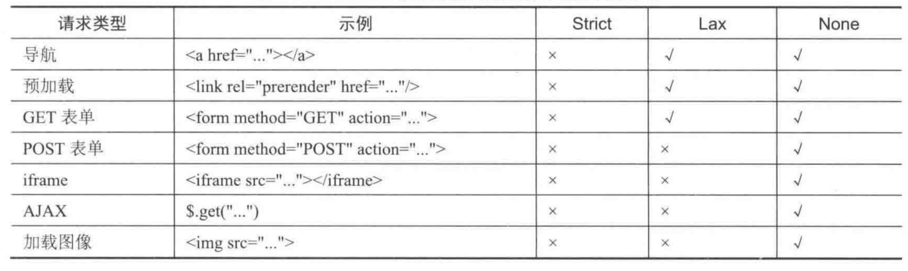

# 简介

Cookie和会话是Web应用中的基础概念，有了会话的机制，Web应用才能记住访问者的状态。在长连接的应用中（如SSH)，用户登录成功之后，服务端可以认为后续都是这个账号在操作，从登录成功到断开连接，整个过程称为一个会话。但是在Web应用中，我们一般通过Cookie来实现会话，它关系到不同账号的状态，其中还涉及敏感数据，所以Cookie的安全性至关重要。

如果Web应用希望存储一些敏感数据或不希望被用户篡改的数据，最好的办法是将数据存储在服务端，并且为该用户的数据分配一个随机的ID，在客户端仅存储这个ID，然后用户每次访问服务器都要带上这个ID，服务端用这个ID去查已存储的数据就知道当前的访问者是谁。

也有一些应用将会话数据加密后存放在Cookie中，服务端就不需要存储会话数据，而是每次收到请求后都解密Cookie中的数据，取出会话数据的内容，这样也达到了用户不可读和不可篡改的目的。但是这种做法会有一些安全上的问题，后面会讲到。

# 第一方Cookie和第三方Cookie

第一方Cookie(First-Party Cookie)是指用户当前访问的网站直接植入的Cookie，通常是网站用于正常功能的Cookie，比如标识用户身份、记住用户的语言设置等，这些Cookie必须存在，否则用户只能以匿名身份访问，网站也无法记住用户的偏好设置。

当用户访问一个网站时，如果这个网站加载了其他网站的资源，此时由其他网站植入的Cookie 就称为第三方Cookie（Third-Party Cookie)。比如一个网站嵌入了另一个网站的广告或者访问统计代码，通常这些第三方Cookie是用于追踪访问者，实现个性化广告投放的。

当不同的网站嵌入了同一个第三方网站资源时，用户访问这些网站时会带上相同的第三方Cookie去加载第三方资源，所以第三方网站通过这个第三方Cookie就可以实现用户在不同网站的访问行为分析，从而实现更精准的广告投放。假设你经常访问体育相关的网站，那么你在其他的网站上可能也会看到体育相关的商品广告，因为这些网站嵌入了同一个广告提供商的代码。

所有浏览器都会接受第一方Cookie，但是浏览器的隐私策略（浏览器会有一个过度采集用户数据的第三方网站名单，当这些网站作为第三方Cookie时，会禁止它们附加在用户的Cookie里，同时有的浏览器会定期删除第三方Cookie）可能会阻止部分第三方Cookie。下面要介绍的SameSite属性也会阻止第三方Cookie。

# Cookie 属性

在Web安全中，Cookie相当于服务端颁发给用户的身份凭证，如果攻击者获取了用户的凭证，就相当于获取了用户的身份，即不需要账号与密码就可登录该账号，所以保证Cookie的安全至关重要。
Cookie有多个属性，服务端在设置Cookie时可以设置相应的属性值，基本上每个属性都与安全有关系，下面我们逐一介绍。

## Domain属性

Domain属性用于指定Cookie在哪些域名中生效，即访问哪些域名时浏览器会发送这个Cookie，该属性也决定了哪些域名的网页可以通过JavaScript访问这个Cookie。如果域名前面带一个点号“.”表示该Cookie对当前域名及其子域名都有效，浏览器访问这些子域名时都会带上这个Cookie；如果域名前不带点号，表示Cookie仅对当前域名有效。

在服务端通过 Set-Cookie写入Cookie，或者前端页面通过JavaScript设置Cookie时，根据RFC6265中的义，可以将Domain的值指定为当前域名或者当前域名的父域名，但不能指定为当前域名的子域名，否则浏览器会拒绝写入。

如果在Set-Cookie中不指定Domain属性，Cookie的生效范围仅限于当前域名(即请求中Host头指定的域名)，它被称为Host-OnlyCookie。目前主流的浏览器都遵循RFC6265规范，在Set-Cookie或JavaScript中写入Cookie时只要加了Domain属性，即使没有点号“.”前缀，它也不是Host-OnlyCookie。例如在Set-Cookie中指定了 Domain属性，即使指定Domain=example.com,Cookie的生效范围也是.example.com，即对所有子域名也生效，这么做实际上是扩大了Cookie的生效范围，让子域名应用也能访问这个Cookie。所以在没有与子域名网站共享登录状态的情况下，在Set-Cookie中不显式指定Domain属性是更安全的做法。

需要注意的是，Domain属性不包含端口信息，即Cookie的域名隔离不受端口的限制，如果一个域名同时在不同的端口运行了多个Web应用，使用Cookie存储重要数据时也需要评估每个应用的安全性，防止Cookie通过其中某个应用的安全漏洞被泄露出去。

其他子域名的应用或者其他端口的应用除了可以读取当前应用的Cookie，也能写入特定名称的Cookie，从而干扰当前应用，让它读到错误的Cookie内容，常见的攻击方式是固定会话攻击，后面会详细介绍。

## Path属性

Path属性用于指定Cookie的生效路径，只有访问这个路径或其子路径时，浏览器才会发送这个Cookie。如不设置，Path属性的默认值就是当前页面所在的路径。如果一个域名中不同路径有很多不同的应用，同名的Cookie会造成干扰，这时可以设置Cookie的Path属性将它们区分开来。
但是不能依赖Path属性来做安全隔离，因为在浏览器中一个路径的页面可以通过iframe嵌入另一个路径的页面，而这两个页面是同源的，所以它们之间的DOM可以互访问，一个路径的页面可以读取另一个路径页面的Cookie。例如，有一个敏感的Cookie设置了Path=/admin/，这个路径以外的其他页面可以通过如下代码获取这个敏感的 Cookie:

```html
<iframe id="test" src="/admin/" width=0 height=O></iframe>
<script>
window.onload = function () {
alert(document.getElementById('test').contentDocument.cookie);
子
</script>
```

通过这个做法，每个页面都能读取当前域名任何路径下的Cookie，所以在一个域名的不同路径下运行相互不信任的Web应用也是危险的做法。这个安全问题比较常见，经常有网站在路径example.com/forum/下运行了一个论坛系统，然后又在路径example.com/wiki/下运行了一个wiki系统，即使二者的Cookie都设置了Path属性，也起不到隔离作用，一个应用的漏洞会威胁另一个应用。更安全的做法是，将不同的应用部署在不同的域名或子域名下，让同源策略保证Cookie的安全性。

## Expires属性

服务端可以通过Expires属性来设置Cookie的有效期，浏览器会在这个Cookie到期后自动将其删除。没有指定Expires属性的Cookie叫“临时Cookie”，关掉浏览器后将自动删除。有些地方也将临时Cookie称为“会话Cookie”，即仅在当前会话中有效，可以实现关掉浏览器就自动结束会话，下次再打开网站则需要重新登录。
需要注意的是，部分浏览器可以设置成每次启动时“打开上一次浏览的网页”，浏览器为了保证下次启动时用户体验的连续性，即使关闭浏览器也不会删除临时Cookie。在这种情况下，临时Cookie实际上已经成为永久Cookie。
设置了有效期的Cookie，浏览器并不能保证它在有效期之内不会被删除，浏览器对每个站点有最大Cookie数量的限制，超过这个限制时会删除I旧的Cookie。所以如果存在可以向受害者植入Cookie的漏洞(如CRLF注入漏洞)，攻击者可以植入多个Cookie，导致受害者的正常Cookie被“挤掉”。

## HttpOnly属性

在大多数情况下，Cookie只是用来与服务端交互的，并不需要让客户端的JavaScript读取它。允许JavaScript读取 Cookie会增加Cookie泄露的风险，如果网站存在跨站脚本(XSS)漏洞，恶意脚本就可以窃取受害用户的Cookie，盗取身份凭证。
HttpOnly属性的作用是让Cookie只能用于HTTP/HTTPS传输，客户端JavaScript无法读取它，从而在一定程度上减少了XSS漏洞带来的危害。

但是，某些服务端应用框架的调试或报错信息会展示HTTP请求头的内容，PHP开发人员常用的获取服务端信息的phpinfoO函数也会展示请求头信息（如图4-3所示)，这样会使Cookie泄露到Web前端页面。如果站点存在XSS漏洞，还是可以通过 JavaScript 获取带有HttpOnly属性的 Cookie。

在ApacheHTTP Server 2.2.x版本中，当HTTP请求头的长度超过所允许的最大值时，服务器会返回一个400错误页面，其中包含了所有请求头信息。在存在XSS漏洞的应用中，通过XSS生成一个超长的Cookie，再通过XMLHttpRequest访问服务端，就可以读取带有HttpOnly属性的 Cookie。
可以看到，通过JavaScript代码读取带有HttpOnly属性的Cookie都要借助服务端输出的内容，所以除了对关键Cookie设置前端保护措施，还要关注服务端有没有输出Cookie的场景。

HttpOnly的设计体现了**最小权限原则**，通过浏览器内核级别的强制隔离，有效阻断了JavaScript对敏感Cookie的访问，是Web安全防御体系中不可或缺的一环。

## Secure属性

给Cookie设置Secure属性后，该Cookie只会在HTTPS请求中被发送给服务器，非加密的HTTP请求是不会发送该Cookie的，确保了它不会在网络中以明文传输。
同时,在客户端通过JavaScript设置Cookie,或者在服务端通过 Set-Cookie头来设置Cookie时，如果当前网站用的是HTTP协议，写入带Secure属性的Cookie会失败。

## SameSite属性

SameSite是一个新的安全属性，服务端在Set-Cookie响应头中通过SameSite属性指示是否可以在跨站请求中发送该Cookie，即它能不能作为第三方Cookie。这个属性有3种值：

### None

不做限制，任何场景下都会发送Cookie。这个设置其实与以往浏览器不支持SameSite特性时的效果是一样的，但是当SameSite被设置为None时，要求Cookie带上 Secure属性，即只能在HTTPS协议中发送。

### LAX
在普通的跨站请求中都不发送Cookie，但是导航到其他网站时(如点击链接)会发送Cookie。另外，在跨站点提交表单的场景中，只有GET方法提交的表单会带Cookie，使用POST提交表单时不会带 Cookie。当Cookie没有指定SameSite属性时，现代浏览器的表现与SameSite=Lax时一致。

### Strict
SameSite属性为Strict 表示严格模式，即完全禁止在跨站请求中发送Cookie，即使点击站外链接也不会发送Cookie，只有当请求的站点与浏览器地址栏URL中的域名属于同一个站点（即“第一方”站点）时，才会发送Cookie。这是非常严格的跨站点策略，假如用户已经登录A网站，他在B网站点击链接跳转到A网站时，也不会带上A网站的Cookie，此时A网站还是给用户展示未登录页面。



因为SameSite属性可以在某些场景中阻止跨站发送Cookie，在依赖Cookie作为身份凭证的应用中，跨站请求不发送Cookie就没办法实施CSRF攻击，所以设置SameSite属性可以在一定程度上缓解CSRF攻击。关于CSRF攻击，我们会在后面的章节详细介绍。

除了影响Cookie的发送，SameSite还会影响跨站点Cookie的写入。跨站点Cookie的写入分为两种情况:在客户端通过JavaScript写入以及在服务端通过Set-Cookie写入。

对于前端(客户端）写入的Cookie，浏览器默认也将SameSite属性设置为Lax。我们可以做如下测试：通过iframe载入其他站点，并且iframe中的站点通过JavaScript代码写入未设置SameSite属性的Cookie，这就是跨站点写入SameSite=Lax的Cookie。我们会发现浏览器阻止了写入这个Cookie。

## SameParty

如果一个企业运营了多个不同站点，如taobao.com和tmall.com，这时即使将SameSite属性设置为LAX还是过于严格，会给跨域访问带来很多不便。所以，浏览器厂商提出了SameParty的概念，允许企业将多个网站定义成一个可信站点集合，称为First-PartySets(第一方站点集合)。

网站将可信站点集合定义在/well-known/first-party-set文件中，当一个网站的页面要请求另一个网站资源时，浏览器会检测这两个网站是否同处一个First-PartySets，如果是，那么带有 SameParty属性的第三方Cookie 也会被带上。
目前SameParty属性作为谷歌隐私沙盒的一部分功能，暂时只有Chrome支持，未来的发展还具有诸多不确定性，这里就不做详细介绍。

# 安全使用Cookie

### Cookie前缀

### __Host-

如果一个Cookie的名称中有这个前缀，服务端通过 Set-Cookie头设置Cookie，或者前端脚本通过document.cookie属性设置Cookie时，只有满足以下4个条件，浏览器才会接受这个Cookie:

- 带有Secure属性
- 不包含Domain属性
- Path属性为“/”
- 当前为HTTPS连接

如果当前页面的路径是根路径“/”，有部分浏览器还是要求显示指定Path=/，也有部分浏览器不需要再指定Path属性。

### __Secure-

如果一个Cookie的名称中有这个前缀，只有带Secure属性且当前连接为HTTPS，浏览器才会接受这个Cookie，相对“_Host-”前缀而言，它是约束更少的弱化版本。

如果带前缀的Cookie不满足这些约束条件，浏览器会拒绝写入这些Cookie。带有“_Host-”前缀的Cookie不能包含Domain属性，其实是将该Cookie跟域名绑定，只能由当前域名植入，不能对子域名生效，所以服务端收到这种前缀的Cookie时可以确定是否为自已域名植入的。如果Cookie名中带“_Secure-”前缀，就确保了这个Cookie是在安全连接的环境下写入的，不会存在网络中间人的篡改。

目前主流的浏览器(除IE浏览器外）都支持Cookie前缀特性，即使浏览器不支持也不会有额外的副作用。如果要确保Cookie在安全的传输环境下被植入到客户端，可在Cookie名称中加入“_Secure-”前缀：在子域名非常多的场景中，特别是子域名的安全不受控制时，建议网站为关键的Cookie在其名称中添加“_Host-”前缀，以确保该Cookie不受其他域名影响。

## 保密性和完整性

站在Web服务器的角度看，Cookie对用户是完全公开的，使用浏览器提供的开发者工具可以很方便查看所有Cookie，所以Cookie对用户是没有保密性的。这就意味着Web服务端不能将自身的机密数据写入Cookie。Cookie通常只有一份数据存储在客户端，服务端不会有副本再进行校验，用户可以很容易地修改Cookie的内容，所以对Web服务器而言，应该把Cookie当作不可信的外部输入数据，不能用Cookie数据来做关键的判断。

一个常见的漏洞案例是，Web应用将用户的ID或角色写在Cookie中，仅仅通过Cookie值来判断用户的身份和角色。例如普通用户的Cookie中isAdmin=0，管理员的Cookie中isAdmin的值是1，如果普通用户篡改自己的Cookie，将isAdmin的值改成1，他就有了管理员角色。更安全的做法是将重要数据保存在服务端，如果一定要存储在Cookie中，需要将数据加密或签名。

更安全的做法是将重要数据保存在服务端，如果一定要存储在Cookie中，需要将数据加密或签名。

站在整个Web应用的角度看，对Cookie应该实现保密性，标识会话的Cookie像一把钥匙一样，是用户访问服务器的凭证，不能让其他用户或其他应用拿到。而Web应用的很多特性让Cookie很难实现保密性，例如子域名应用共享Cookie的问题、跨端口可访问的问题。在这些场景中就要非常小心，尽量将不同的应用部署在不同的子域名下，并使用Cookie前缀将Cookie与域名绑定。

# 会话安全

在Web应用中，会话的本质是标识不同的访问者，并记录他们的状态。攻击者如果窃取到一个合法的会话标识，或者伪造会话标识，都相当于盗取了一个账号的身份。如果服务端会话管理不当，也可能造成敏感数据泄露。

## 会话管理

### 会话ID的随机性
会话ID(SessionID）最基本的要求是随机性，让攻击者无法猜测出来。所以，不能简单地使用用户的ID、时间戳等数据作为SessionID，也不能基于用户的公开信息简单计算出一个值。同时，SessionID也要足够长，以防止攻击者通过遍历穷举的方法获取SessionID。

### 过期和失效

很多比较敏感的应用都有超时自动退出账号的机制，大多数有“记住登录状态”功能的应用也会有超时机制，只是这个超时时间设置得比较长。在有超时机制的Web应用中，不应该仅通过Cookie的有效期来实现超时退出，因为访问者可以任意修改Cookie的Expires属性，或者他记住这个值后一直重复使用，所以超时机制应该是在服务端来实现的。如果应用的需求是客户端在一定时间后退出登录状态，应该由服务端在时间到期后删除已存储的会话数据，或者标记一个SessionID已失效。

另外，在修改密码、账号挂失等业务场景中，也应该在服务端使该账号相关的会话数据失效，这样攻击者盗取的账号也会被强行退出。

### 绑定客户端

在应用中，如果将会话与客户端绑定会更安全，因为即使攻击者窃取了SessionID，也无法在新的设备中登录目标网站。

在Web应用中可以将浏览器User-Agent与会话绑定，这种绑定关系比较弱，在移动App中有更好的唯一标识客户端的机制，可以实现会话与设备之间更强的绑定关系。

另一个更安全的做法是，在登录时将会话与访问者的IP地址绑定，不少网银App有这种机制，所以当手机从蜂窝网络切换到家里Wi-Fi时，网银App会要求你重新登录。这种机制可以带来更强的安全保护，但是在一定程度上也影响了用户体验。

### 安全传输

现代Web应用基本上都是将 SessionID写入Cookie中，所以设置相应Cookie的安全属性非常重要，大多数情况下建议开启HttpOnly和Secure属性。
一些老的Web应用通过URL参数来传递SessionID，这是非常不安全的做法，有很多场景可能造成SessionID泄露，例如：

- 在跳转到站外链接，或者加载其他站点的资源时，SessionID会通过Referer被泄露出去。
- 在浏览器历史记录中会保存URL，现代浏览器还支持多设备之间同步历史记录。
- 服务端日志通常会记录URL，这些日志可能被分发给做日志分析的团队和部门。
- 用户不会意识到URL中存在敏感信息，可能将URL通过论坛分享给他人。

### 客户端存储会话

前面讲的会话案例全部是会话存储在服务端的场景，客户端只保存一个很短的SessionID。也有一些应用将会话存储在客户端，最典型的就是将JWT（JSONWebToken）用于会话管理。

JWT本质上是带签名的JSON数据，有必要的情况下也可以对它加密。在用户登录后，服务端将会话信息生成为一个带签名的JWT写入客户端，客户端每次访问时都带上JWT，服务端可以验证签名的有效性，并提取会话相关的信息。使用这种机制可以将会话完全存储在客户端，使服务端无状态，所以非常容易对服务端扩容，后端有Web服务器集群时不需要在多台服务器之间做会话同步。

客户端存储会话有一个致命的缺陷，就是已签发的会话Token无法吊销，这将导致很多账号安全功能无法实施，如退出账号、修改密码等。因此，只能在签发Token时加入Token有效期，并尽量使用短的有效期，但是过短的有效期又会影响用户体验。

另外，签名用的密钥的安全管理也很重要，一旦密钥被泄露，攻击者就可以签发任意账号的JWT，使所有账号都受到威胁。

## 固定会话攻击

前面已经讲到，用于标识会话的SessionID是个随机值，攻击者没有办法猜测用户的SessionID。但是在一些场景中，攻击者可以诱导用户使用攻击者指定的SessionID，当受害者登录成功后，这个SessionID就关联了受害者的身份，相当于攻击者拥有了受害者在目标网站上的身份。这种攻击叫固定会话攻(SessionFixation)

在攻击过程中有一个关键的步骤，就是让受害者使用攻击者指定的SessionID，有几种办法可以实现这一步

前面讲到的Cookie生效范围，在有多个子域名应用的场景中，一个恶意的子域名应用可以设置一个在其他子域名也生效的Cookie，这样恶意应用就可以设置受害者在其他应用的SessionID。类似的场景还有同一个域名在不同端口运行了多个应用，或者在一个域名的不同路径下运行了不同的应用，恶意应用都可以写入一个在其他应用中也有效的Cookie。

在一些应用中，允许通过URL参数来指定SessionID。在老的PHP和Java应用中◎，攻击者诱导受害者点击一个带有SessionID参数的链接，即可给受害者指定SessionID，例如：`http://example.com/login.php?PHPSESSID=123`。

另外，在存在XSS漏洞或CRLF注入漏洞的应用中，攻击者也可能给受害者植入特定的Cookie来实施固定会话攻击。

固定会话攻击与现实生活中的一个例子非常相像：如果我们租了一套房子，安全的做法是立即换一套门锁，让之前的钥匙失效，因为上一任租客可能私自留了一把钥匙。在固定会话攻击中，SessionID就像是访问账户信息的钥匙，它有可能是受他人控制的，所以当用户的登录状态发生变化后，服务端应该为用户生成一个新的SessionID，这样就杜绝了固定会话攻击。