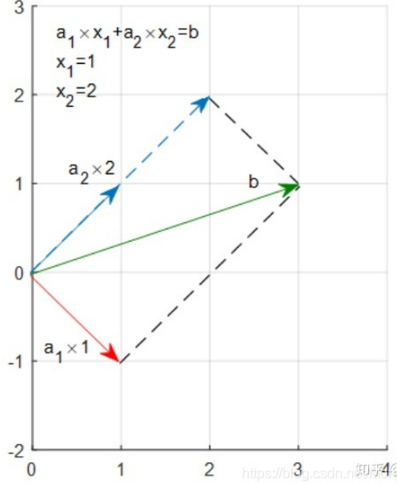
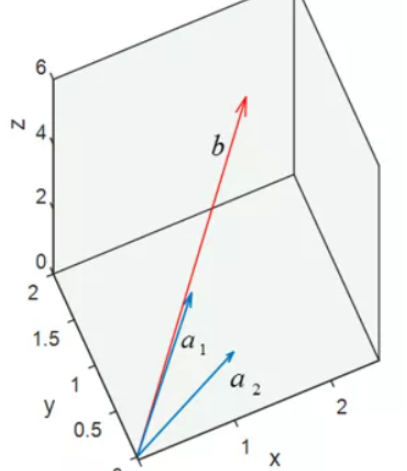

## 最小二乘法的引出

工程应用中，我们经常会用一组观测数据去估计模型的参数，模型是我们根据先验知识定下的。比如我们有一组观测数据$(x_i,y_i)$,通过一些数据分析我们猜测y和x之间存在线性关系，那么我们的模型就可以定为：$f ( x ) = k x + b$ 

这个模型只有两个参数，所以理论上，我们只需要观测两组数据建立两个方程，即可解出两个未知数。类似的，假如模型有n个参数，我们只需要观测n组数据就可求出参数，换句话说，在这种情况下，模型的参数是唯一确定解。

但是在实际应用中，由于我们的观测会存在误差（偶然误差、系统误差等），所以我们总会做多余观测。比如在上述例子中，尽管只有两个参数，但是我们可能会观测n组数据$(x_1,y_1),\cdots,(x_n,y_n)$ ，这会导致我们无法找到一条直线经过所有的点，也就是说，方程无确定解。

于是这就是我们要解决的问题：虽然没有确定解，但是我们能不能求出近似解，使得模型能在各个观测点上达到最佳拟合。那么最佳的准则是什么？可以是所有观测点到直线的距离和最小，也可以是所有观测点到直线的误差（真实值-理论值）绝对值和最小，也可以是其它，如果是你面临这个问题你会怎么做？
早在19世纪，勒让德就认为让误差的平方和最小估计出来的模型是最接近真实情形的。

为什么就是误差平方而不是其它的，这个问题连欧拉、拉普拉斯都未能成功回答，后来是高斯建立了一套误差分析理论，从而证明了确实是使误差平方和最小的情况下系统是最优的。

按照勒让德的最佳原则，于是就是求：$L=\sum_{i=1}^{n}(y_i-f(x))^{2}
$

这个目标函数取得最小值时的函数参数，这就是最小二乘法的思想，所谓二乘就是平方的意思。从这里我们可以看到，最小二乘法其实就是用来做函数拟合的一种思想。

至于怎么求出具体的参数那就是另外一个问题了，理论上可以用导数法、几何法，工程上可以用梯度下降法。下面以最常用的线性回归为例进行推导和理解。

线性回归因为比较简单，可以直接推导出解析解，而且许多非线性的问题也可以转化为线性问题来解决，所以得到了广泛的应用。甚至许多人认为最小二乘法指的就是线性回归，其实并不是，最小二乘法就是一种思想，它可以拟合任意函数，线性回归只是其中一个比较简单而且也很常用的函数，所以讲最小二乘法基本都会以它为例。

下面我会先用矩阵法进行推导，然后再用几何法来帮助你理解最小二乘法的几何意义。

## 矩阵解法

线性回归定义为：$h_{w}\left(x_{1}, x_{2}, \ldots x_{n-1}\right)=w_{0}+w_{1} x_{1}+\ldots+w_{n-1} x_{n-1}$ （$w$ 为参数）假设现在有m个样本，每个样本有n − 1维特征，将所有样本点代入模型中得：

$$
h_1 = w_0 + w_1x_{1,1} + w_2x_{1,2} + … + w_{n−1}x_{1,n − 1} \\
h_2 = w_0 + w_1x_{2,1} + w_2x_{2,2} + … + w_{n−1}x_{2,n − 1} \\
\vdots \\
h_m = w_0 + w_1x_{m,1} + w_2x_{m,2} + … + w_{n−1}x_{m,n − 1}
$$

为方便用矩阵表示，我们令$x_0=1$，于是上述方程可以用矩阵表示为：$\mathbf{h}=\mathbf{X}w$
其中, h为$m\times 1$的向量, 代表模型的理论值，$w$为$n\times 1$的向量，X为$m\times n$维的矩阵，m代表样本的个数,n代表样本的特征数，于是目标损失函数用矩阵表示为：

$$
J(w)=\|\mathbf{h}-\mathbf{Y}\|^2 =\|\mathbf{X}w-\mathbf{Y}\|^2= (\mathbf{X} w-\mathbf{Y})^{T}(\mathbf{X} w-\mathbf{Y})

$$

其中$\mathbf{Y}$是样本的输出向量, 维度为$m\times 1$。

根据高数知识我们知道函数取得极值就是导数为0的地方，所以我们只需要对损失函数求导令其等于0就可以解出$w$。

对目标函数$J$化简得:

$$
J(w)=w^TX^TXw-W^TX^TY-Y^TXw+Y^TY
$$

求导令其等于0:

$$
\frac{\partial}{\partial w} \mathrm{J}(w) = 2\mathrm{X}^\mathrm{T}\mathrm{X}w - 2\mathrm{X}^\mathrm{T}\mathrm{Y} = 0
$$

解得$w=(X^TX)^{-1}X^TY$, 经过推导我们得到了$w$的解析解，现在只要给了数据，我们就可以带入解析解中直接算出$w$。

## 几何意义

几何意义会直观的帮助你理解最小二乘法究竟在干什么。首先先来解释一下矩阵乘法的几何意义，对于一个方程组Ax，我们可以看做是x对矩阵A的列向量的线性组合，比如：

$$
\begin{cases} 
1 \times x_1 + x_2 = 3 \\ 
-1 \times x_1 + x_2 = 1 
\end{cases}
\Leftrightarrow
\begin{bmatrix} 
1 & 1 \\ 
-1 & 1 
\end{bmatrix}
\begin{bmatrix} 
x_1 \\ 
x_2 
\end{bmatrix}
=
\begin{bmatrix} 
3 \\ 
1 
\end{bmatrix}
\Leftrightarrow A \mathbf{x} = \mathbf{b}

$$

可以看作:

$$
\begin{bmatrix} 
1 \\ 
-1 
\end{bmatrix} \times x_1 + 
\begin{bmatrix} 
1 \\ 
1 
\end{bmatrix} \times x_2 =
\begin{bmatrix} 
3 \\ 
1 
\end{bmatrix}
\Leftrightarrow \mathbf{a}_1 x_1 + \mathbf{a}_2 x_2 = \mathbf{b}

$$

画在坐标轴上可以看到，向量**b**其实就是向量$mathbf{a_1}和mathbf{a_2}$​的线性组合，因为他们都是在一个平面上，显然是有解的。

如文章开头所说，由于存在观测误差，我们往往会做多余观测，比如要拟合一次方程 y = kx + b，我们可能观测了三个点（0,2）,（1,2）,（2,3），写成矩阵形式如下(为表述方便，用x1代替k，x2代替b )：

$$
\begin{cases} 
1 \times x_1 + x_2 = 2 \\ 
0 \times x_1 + x_2 = 2 \\ 
2 \times x_1 + x_2 = 3 
\end{cases}
\Leftrightarrow
\begin{bmatrix} 
1 & 1 \\ 
0 & 1 \\ 
2 & 1 
\end{bmatrix}
\begin{bmatrix} 
x_1 \\ 
x_2 
\end{bmatrix}
=
\begin{bmatrix} 
2 \\ 
2 \\ 
3 
\end{bmatrix}
\Leftrightarrow A \mathbf{x} = \mathbf{b}
$$

表示成线性组合的方式：

$$
\begin{bmatrix} 
1 \\ 
0 \\ 
2 
\end{bmatrix}
x_1 +
\begin{bmatrix} 
1 \\ 
1 \\ 
1 
\end{bmatrix}
x_2 =
\begin{bmatrix} 
2 \\ 
2 \\ 
3 
\end{bmatrix}
\Leftrightarrow \mathbf{a}_1 x_1 + \mathbf{a}_2 x_2 = \mathbf{b}
$$

画在图中如下：

从图中我们可以看到，无论$\mathbf{a_1}和\mathbf{a_2}$, 怎么线性组合都不可能得到 $\mathbf{b}$，因为$\mathbf{a_1}和\mathbf{a_2}$的线性组合成的向量只能落在它们组成的子空间$S$中。

退而求其次，虽然我们不可能得到$\mathbf{b}$，但在$S$上找一个和$\mathbf{b}$最接近的总可以吧。那么将$\mathbf{b}$投影 在平面$S$上得到的向量$\mathbf{p}$就是和$\mathbf{b}$最接近的向量（把向量看作点，最接近的意思就是点到平面某点取得距离最短，自然就是投影所成的交点）。

换句话说，方程组**Ax=b**虽然无解，也就是**b**不在**A**的列空间中，但是我们可以在**A**的列空间中找到一个和b最接近的向量**p**，**p**就是**b**在**A**的列空间中的投影，通过求**Ax=p**的解，就是原方程的最小二乘解。
由几何意义可知垂线$\mathbf{e} = \mathbf{b} - \mathbf{p} = \mathbf{b} - \mathbf{A}\mathbf{x}$正交于平面 $S$，即满足：$\mathbf{a}_1^T \mathbf{e} = 0, \quad \mathbf{a}_2^T \mathbf{e} = 0$,写成矩阵形式为：

$$
A^T \mathbf{e} = A^T (\mathbf{b} - A\mathbf{x}) = A^T \mathbf{b} - A^T A \mathbf{x} = \mathbf{0}
$$

解得最小二乘解：$\mathbf{x} = (A^T A)^{-1} A^T \mathbf{b}
$,可以看到推导结果和矩阵法一样。从上面可以看到，最小二乘法的几何意义就是求解 **b** 在**A**的列向量空间中的投影。
