## TCP和UDP

我们知道网络层，可以实现两个主机之间的通信。但是这并不具体，因为，真正进行通信的实体是在主机中的进程，是一个主机中的一个进程与另外一个主机中的一个进程在交换数据。IP协议虽然能把数据报文送到目的主机，但是并没有交付给主机的具体应用进程。而端口对端口的通信才应该是应用进程之间的通信。

UDP，在传送数据前不需要先建立连接，远地的主机在收到UDP报文后也不需要给出任何确认。虽然UDP不提供可靠交付，但是正是因为这样，省去和很多的开销，使得它的速度比较快，比如一些对实时性要求较高的服务，就常常使用的是UDP。对应的应用层的协议主要有DNS,TFTP,DHCP,SNMP,NFS等。

 TCP，提供面向连接的服务，在传送数据之前必须先建立连接，建立连接就是确保双方的网络是通畅的，数据传送完成后要释放连接，而且每发送一个数据包都要收到确认信息才会发送另外一个数据包。因此TCP是一种可靠的的运输服务，但是正因为这样，不可避免的增加了许多的开销，所以速度相比UDP就慢一些，比如确认，流量控制等。对应的应用层的协议主要有 SMTP,TELNET,HTTP,FTP等。

### TCP三次握手

TCP协议在发送数据包的时候，会发送多种类型的数据包，每种数据包都有特殊的意义，每个中数据包都会在数据包里面添加上特定的标识数据来表示数据包的意义，比如：

- SYN 建立链接

- ACK 回应标识

- FIN 断开链接

- PSH 数据包

- RST 重置（重传） 网络不稳定的时候会看到好多重发包

- URG 紧急指针

TCP建立连接需要三次握手

1. TCP服务器进程先创建传输控制块TCB，时刻准备接受客户进程的连接请求，此时服务器就进入了LISTEN（监听）状态；

2. TCP客户进程也是先创建传输控制块TCB，然后向服务器发出连接请求报文，将报文头中SYN标志位设置为1，同时选择一个初始序列号 seq=x ，此时，TCP客户端进程进入了 SYN-SENT（同步已发送状态）状态。TCP规定，SYN报文段（SYN=1的报文段）不能携带数据，但需要消耗掉一个序号。

3. TCP服务器收到请求报文后，如果同意连接，则发出确认报文。确认报文中应该 ACK=1，SYN=1，确认号是ack=x+1，同时也要为自己初始化一个序列号 seq=y，此时，TCP服务器进程进入了SYN-RCVD（同步收到）状态。这个报文也不能携带数据，但是同样要消耗一个序号。

4. TCP客户进程收到确认后，还要向服务器给出确认。确认报文的ACK=1，ack=y+1，自己的序列号seq=x+1，此时，TCP连接建立，客户端进入ESTABLISHED（已建立连接）状态。TCP规定，ACK报文段可以携带数据，但是如果不携带数据则不消耗序号。

5. 当服务器收到客户端的确认后也进入ESTABLISHED状态，此后双方就可以开始通信了。

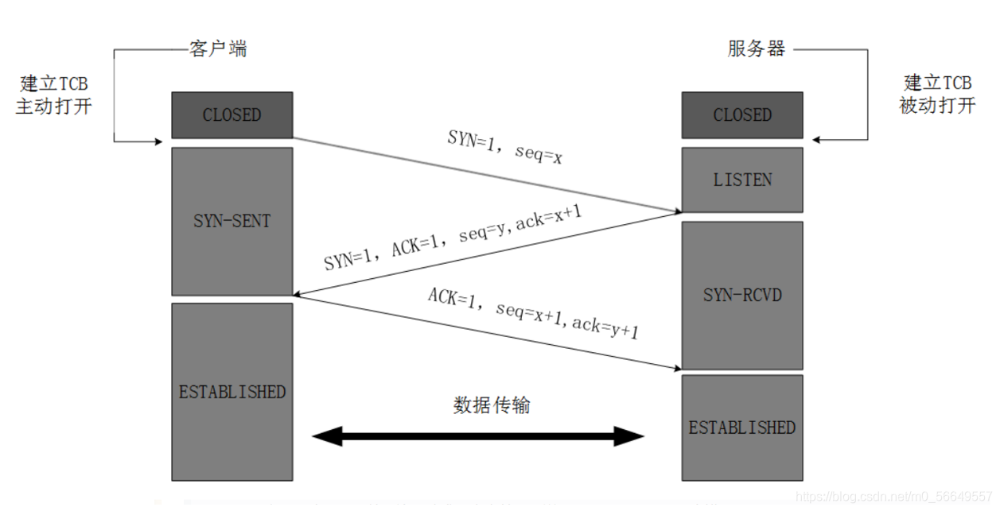

为什么TCP客户端还要再发送一次确认？

```
一句话，主要防止已经失效的连接请求报文突然又传送到了服务器，从而产生错误。如果使用的是两次握手建立连接，假设有这样一种场景，客户端发送了第一个请求连接并且没有丢失，只是因为在网络结点中滞留的时间太长了，由于TCP的客户端迟迟没有收到确认报文，以为服务器没有收到，此时重新向服务器发送这条报文，此后客户端和服务器经过两次握手完成连接，传输数据，然后关闭连接。此时此前滞留的那一次请求连接，网络通畅了到达了服务器，这个报文本该是失效的，但是，两次握手的机制将会让客户端和服务器再次建立连接，这将导致不必要的错误和资源的浪费。如果采用的是三次握手，就算是那一次失效的报文传送过来了，服务端接受到了那条失效报文并且回复了确认报文，但是客户端不会再次发出确认。由于服务器收不到确认，就知道客户端并没有请求连接。
```

### TCP四次挥手

断开连接需要四次挥手，数据传输完毕后，双方都可释放连接。最开始的时候，客户端和服务器都是处于ESTABLISHED状态，然后客户端主动关闭，服务器被动关闭。服务端也可以主动关闭。

1. 客户端进程发出连接释放报文，并且停止发送数据。释放数据报文首部，FIN=1，其序列号为seq=u（等于前面已经传送过来的数据的最后一个字节的序号加1），此时，客户端进入FIN-WAIT-1（终止等待1）状态。TCP规定，FIN报文段即使不携带数据，也要消耗一个序号。

2. 服务器收到连接释放报文，发出确认报文，ACK=1，ack=u+1，并且带上自己的序列号seq=v，此时，服务端就进入了CLOSE-WAIT（关闭等待）状态。TCP服务器通知高层的应用进程，客户端向服务器的方向就释放了，这时候处于半关闭状态，即客户端已经没有数据要发送了，但是服务器若发送数据，客户端依然要接受。这个状态还要持续一段时间，也就是整个CLOSE-WAIT状态持续的时间。

3. 客户端收到服务器的确认请求后，此时，客户端就进入FIN-WAIT-2（终止等待2）状态，等待服务器发送连接释放报文（在这之前还需要接受服务器发送的最后的数据）。

4. 服务器将最后的数据发送完毕后，就向客户端发送连接释放报文，FIN=1，ack=u+1，由于在半关闭状态，服务器很可能又发送了一些数据，假定此时的序列号为seq=w，此时，服务器就进入了LAST-ACK（最后确认）状态，等待客户端的确认。

5. 客户端收到服务器的连接释放报文后，必须发出确认，ACK=1，ack=w+1，而自己的序列号是seq=u+1，此时，客户端就进入了TIME-WAIT（时间等待）状态。注意此时TCP连接还没有释放，必须经过2∗∗MSL（最长报文段寿命）的时间后，当客户端撤销相应的TCB后，才进入CLOSED状态。

6. 服务器只要收到了客户端发出的确认，立即进入CLOSED状态。同样，撤销TCB后，就结束了这次的TCP连接。可以看到，服务器结束TCP连接的时间要比客户端早一些。


为什么客户端最后还要等待2MSL？

```
MSL（Maximum Segment Lifetime），TCP允许不同的实现可以设置不同的MSL值。第一，保证客户端发送的最后一个ACK报文能够到达服务器，因为这个ACK报文可能丢失，站在服务器的角度看来，我已经发送了FIN+ACK报文请求断开了，客户端还没有给我回应，应该是我发送的请求断开报文它没有收到，于是服务器又会重新发送一次，而客户端就能在这个2MSL时间段内收到这个重传的报文，接着给出回应报文，并且会重启2MSL计时器。第二，防止类似与“三次握手”中提到了的“已经失效的连接请求报文段”出现在本连接中。客户端发送完最后一个确认报文后，在这个2MSL时间中，就可以使本连接持续的时间内所产生的所有报文段都从网络中消失。这样新的连接中不会出现旧连接的请求报文。
```

为什么连接的时候是三次握手，关闭的时候却是四次握手？

```
建立连接时因为当Server端收到Client端的SYN连接请求报文后，可以直接发送SYN+ACK报文。其中ACK报文是用来应答的，SYN报文是用来同步的。所以建立连接只需要三次握手。

由于TCP协议是一种面向连接的、可靠的、基于字节流的运输层通信协议，TCP是全双工模式。这就意味着，关闭连接时，当Client端发出FIN报文段时，只是表示Client端告诉Server端数据已经发送完毕了。当Server端收到FIN报文并返回ACK报文段，表示它已经知道Client端没有数据发送了，但是Server端还是可以发送数据到Client端的，所以Server很可能并不会立即关闭SOCKET，直到Server端把数据也发送完毕。当Server端也发送了FIN报文段时，这个时候就表示Server端也没有数据要发送了，就会告诉Client端，我也没有数据要发送了，之后彼此就会愉快的中断这次TCP连接。
```

## IP地址

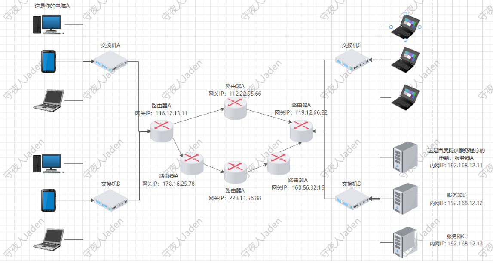

ip地址：看上去是4个点分10进制数字，实际上是32位二进制数ip地址的总数约为43亿个，全球都用，导致ip地址不够用了，大家就想了个办法，将部分ip地址剥离出

来给大家作为内部ip来使用，每个公司或者家庭的网络设备都用这些内部ip地址，然后大家共同使用一个公网ip来进行上网。

ip地址就分为内网ip地址和公网ip地址，内网ip地址又叫做私网ip地址，或者保留ip地址。只有公网ip地址可以上网，这时候就需要一个技术将内网ip地址转换为公网ip地址的技术，叫做NAT(全称：Network Address Translation)，网络地址转换技术，这个技术就内置在了路由器上，所有请求数据包出网的时候，也就是发送到公网上的时候，都是从路由器出去的，都会被路由器上的NAT技术将数据包中的内网ip转换为公网ip。有了公网ip，数据包才能发送到网上去，才能实现互联网通信，也就是可以上网了。这样大家就可以共享一个公网ip来进行上网，ip个数不足的情况也明显得到了改善。因为从所有ip地址中剥离出来的这些内网ip地址，是所有公司或者说所有团体都可以在内部使用的。公网ip在互联网中是全世界唯一的，通过公网ip就能够找到精准的传输目标了。一个公网ip甚至都可以共享给上千万个设备来共享上网使用。

其实，为了科学的使用ip地址，减少浪费，将ip地址根据使用数量级划分为了几类，如下：

```
a类 1.0.0.1~126.255.255.254 # 126*2^8   5.0.0.0 -- 5.255.255.255 
 第一组：1-126开头的地址是A类
 0<A类<127     公网ip在这个地址段的居多，ping qq.com就可以看到58.250.137.36这就是个A类地址。
b类 128.0.0.1~191.255.255.254
 128<=B类<192    
c类 192.0.0.1~223.255.255.254  
# A类、B类、C类地址为三类主要的IP地址，下面两类我们基本见不到。
d类 组播，VRRP协议，keepalive高可用 224~239   
e类 科研 240-255 # 说是保留给科研用的
仔细看的话，可以看到a类和b类中间的127地址段没有划分上，127.0.0.1 - 127.255.255.255整个网段都是特殊地址，127开头的地址可以说是A类的保留地址，用作本地软件环回测试（loopback test）本主机的进程之间的通信而使用的。
```

私有IP地址范围:

```
A类：10.0.0.0~10.255.255.255   # 通过网上的ip地址计算器，就能计算出这个网段有多少个ip地址， A类地址子网掩码是8位
 # 16777214
B类：172.16.0.0~172.31.255.255   # B类地址子网掩码是16位
C类：192.168.0.0~192.168.255.255 # 这个是我们经常看到的网段，内网中网络设备比较少的场景都用的这个，我们买路由器的时候，路由器上内置的网段多数也是这个网段,子网掩码为24位。
```

以上都是ipv4地址, 而2000年左右的时候就爆出来地址不够用了，到现在20多年了，为了缓解ipv4地址不够用的问题,推出了ipv6:

```
解决办法：
   1：ipv6：fe80::2e60:cff:fe9c:a4b3   # 2^128次方的位数，这个数量就相当可观了。
   在这种形式中，128位的IPv6地址被分为8组，每组的16位用4个十六进制字符（0～9，A～F）来表示，组和组之间用冒号（:）隔开。比如IPv6地址2001:db8:130F:0000:0000:09C0:876A:130B，为了书写方便，每组中的前导“0”都可以省略，所以上述地址可写为：
2001:db8:130F:0:0:9C0:876A:130B。  
 另外，地址中包含的连续两个或多个均为0的组，可以用双冒号“::”来代替，这样可以压缩IPv6地址书写时的长度，所以上述地址又可以进一步简写为：2001:db8:130F::9C0:876A:130B。
   2: NAT：network address transformation，网络地址转换
   好处：
       a: 节约大量的公网ip地址
       b：减少了网络攻击
```

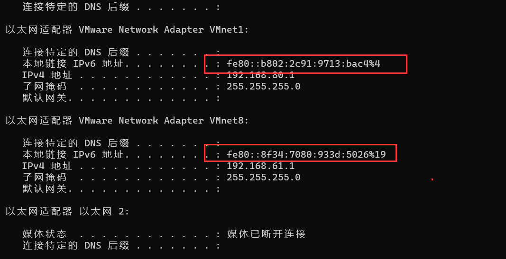

IPv6地址中的百分号是网卡interface标识。这个表示该地址仅限于标号为4的网络接口（一般指网卡或者虚拟网卡）。而在其他网络接口这个地址是无效的。

## 子网掩码的作用

ip地址分为两个部分

- 网络部分：标识子网，也就是网络位或者说网段

- 主机部分：标识主机

> 注意：单纯的ip地址段只是标识了ip地址的种类，从网络部分或主机部分都无法辨识一个ip所处的子网。
>
> 例：172.16.10.1与172.16.10.2并不能确定二者处于同一子网

所谓"子网掩码"，就是表示子网络特征的一个参数。它在形式上等同于IP地址，也是一个32位二进制数字，它的网络部分全部为1，主机部分全部为0。比如，IP地址172.16.10.1，如果已知网络部分是前24位，主机部分是后8位，那么子网络掩码就是11111111.11111111.11111111.00000000，写成十进制就是255.255.255.0。

查看本机子网掩码，如下：

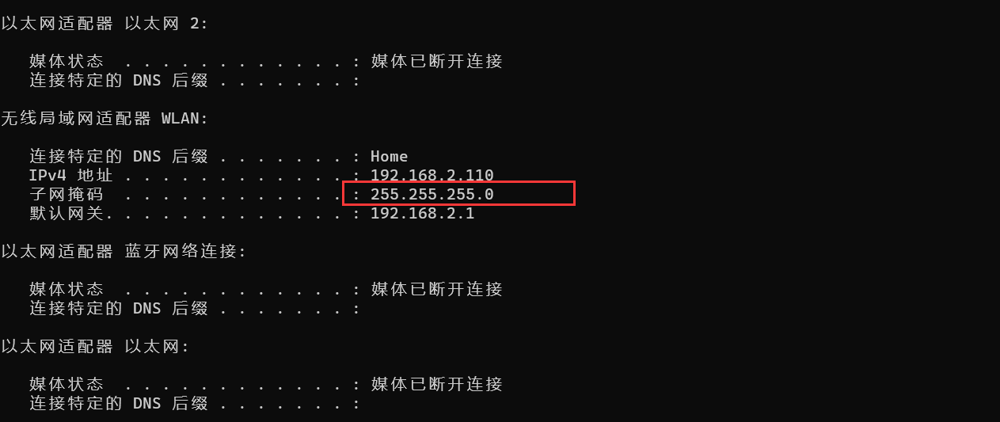子网掩码：决定了一个网段的大小，网段大小决定了有多少个ip地址可以用，网段越大，ip地址越多。

```
ip地址：192.168.2.110 子网掩码：255.255.255.0 
上面两个还有一个等效的写法：192.168.2.110/24
```

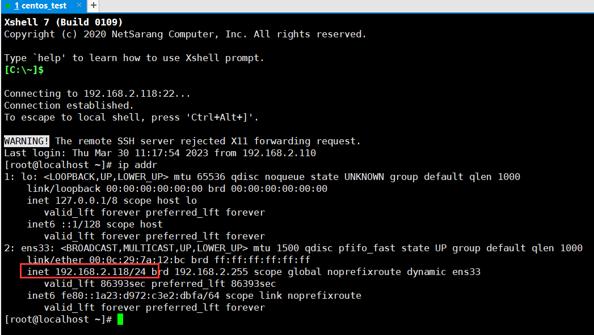

那么子网掩码是怎么计算网段大小的呢？

首先知道"子网掩码"，我们就能判断，任意两个IP地址是否处在同一个子网络。方法就是将两个IP地址与子网掩码分别进行二进制的AND运算，也叫与运算（两个数位都为1，运算结果为1，否则为0），然后比较结果是否相同，如果是的话，就表明它们在同一个子网络中，否则就不是。

```shell
比如，已知IP地址172.16.10.1和172.16.10.2的子网掩码都是255.255.255.0，请问它们是否在同一个子网络？两者与子网掩码分别进行AND运算:
   172.16.10.1：   10101100.00010000.00001010.00000001
   255.255.255.0： 11111111.11111111.11111111.00000000  
   两个
   AND运算得网络地址结果：10101100.00010000.00001010.00000000->172.16.10.0
    
   172.16.10.2：10101100.00010000.00001010.000000010
   255.255.255.0：11111111.11111111.11111111.00000000
   AND运算得网络地址结果：10101100.00010000.00001010.000000001->172.16.10.0
  计算得到的172.16.10.0，就说明这个网段是172.16.10.x。
 255.255.255.0前面的255.255.255对应二进制就是24个1，也就是对应的ip地址的前面24位是不变的，那么ip地址的这24位就是网络位，剩余的8位是主机位，网络位不变，主机位是可变的，可变的ip数量就是这个网段的ip地址数量，共2的8次方=256个，就可以写为172.16.10.1/24。
   但是172.16.10.0和172.16.10.255都被保留下来不让主机使用，172.16.10.0作为网络号，通过网络号可以找到这个网络号对应网段的网络了，172.16.10.255是广播地址，这个广播地址我们一会说。也就是可用ip地址个数位256-2=254个。
所以ip协议有两个作用，一个是为每一台计算机分配IP地址，另一个是确定哪些地址在同一个子网络。
```

同一个网段的ip地址，物理线路接通就可以直接相互通信，不同网段的ip地址，即便是物理线路接通，也不可以直接通信，需要路由器才能相互通信！路由器能够帮我们转发给对应网段的主机。

而当两台主机处于同一个网段下并且主机间能直接收到彼此的广播帧并且用同一二层通信设备连接的情况下就是同一个局域网,同一个局域网通信不需要三层设备(路由器),不需要借助外网IP即可通信。

比如下面两个ip地址:

```shell
11111111.11111111.11111111.10000000   255.255.255.128  
192.168.100.126/25 ---> ip地址：192.168.100.126 子网掩码：255.255.255.128
192.168.100.129/25 ---> ip地址：192.168.100.129 子网掩码：255.255.255.128
# 网络位25位，主机位7位，说明网段又小了。那么这两个ip地址能不能直接通信呢？
192.168.100.126 --> 11000000 10101000 01100100 01111110
 11111111 11111111 11111111 10000000
 逻辑与计算，结果：
 192.168.100.0
192.168.100.129 --> 11000000 10101000 01100100 10000001
 11111111 11111111 11111111 10000000
 逻辑与计算，结果：
 192.168.100.1
 # 计算结果不同，不在一个网段
```

## DHCP

我们的电脑上的ip地址，默认是DHCP服务程序给自动分配的，如果你想自行手动设置ip地址，可以如下操作：

网络-->属性-->更改适配器设置-->鼠标右键点击网卡-->属性，选择ipv4设置，如下就可以手动这是固定的ip地址了

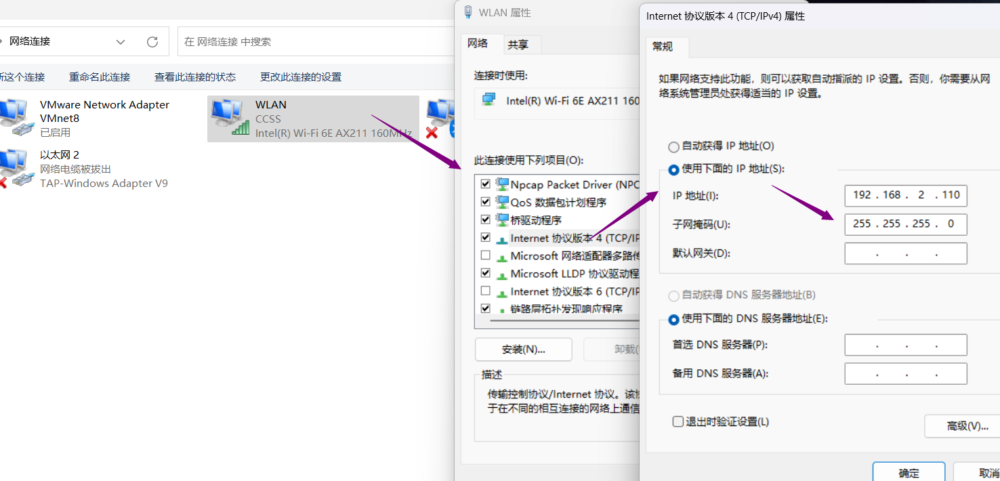手动设置的ip地址，注意不要和你统一网段中其他的主机的ip地址冲突，不然你和他只能一个可以上网。

设置子网掩码的时候也要注意，子网掩码不是随便写的值，只能是下面的几个值：

```
11111111   255
11111110   254
11111100   252
11111000   248
11110000   240
11100000   224
11000000   192
10000000   128
00000000   0
```

## DHCP 工作流程

### DHCP Discover（客户端发现）

- **触发条件**：
  当设备（客户端）接入网络时（如开机、连接Wi-Fi），如果配置为自动获取IP（DHCP客户端模式），会发送 **DHCP Discover** 广播包。
- **数据包内容**：
  - 源MAC：客户端的MAC地址
  - 源IP：`0.0.0.0`（客户端尚未IP）
  - 目标MAC：`FF:FF:FF:FF:FF:FF`（广播）
  - 目标IP：`255.255.255.255`（广播）
  - 报文类型：DHCP Discover
- **作用**：
  寻找网络中的DHCP服务器。

### **（2）DHCP Offer（服务器提供）**

- **服务器响应**：
  所有收到Discover的DHCP服务器会从地址池中选一个可用IP，通过 **DHCP Offer** 包回应客户端（仍为广播或单播，取决于客户端状态）。
- **数据包内容**：
  - 源IP：DHCP服务器的IP
  - 目标IP：`255.255.255.255` 或客户端的临时IP（若服务器支持单播）
  - 包含信息：
    - 分配的IP地址
    - 子网掩码（如 `255.255.255.0`）
    - 默认网关（如 `192.168.1.1`）
    - DNS服务器（如 `8.8.8.8`）
    - 租约时间（如 24小时）

### **（3）DHCP Request（客户端请求）**

- **客户端选择IP**：
  客户端可能收到多个Offer（多个DHCP服务器时），但只会选择 **第一个收到的Offer**，并广播 **DHCP Request** 确认请求。
- **数据包内容**：
  - 目标IP：`255.255.255.255`（广播，通知所有DHCP服务器）
  - 包含信息：
    - 选择的DHCP服务器标识（Server ID）
    - 请求的IP地址

### **（4）DHCP Ack（服务器确认）**

- **最终确认**：
  被选中的DHCP服务器发送 **DHCP Ack** 确认分配，其他服务器收回提供的IP。
- **数据包内容**：
  - 包含完整的网络配置（IP、网关、DNS等）
  - 租约生效时间戳

## DNS

dns：全称domain name system域名系统

作用：将域名解析成ip地址

计算机和计算机之间通信是通过ip:端口来实现的。

比如：192.168.19.36:51000 <----> 192.168.19.40:80

服务端的某些服务程序的端口一般是固定的，客户端根据ip和端口进行连接通信，客户端的ip是固定的，但是端口一般是系统随机分配的。

```
ip地址这个东西其实很难记得住，一个两个还行，多了根本记不住。而且如果某个网站的ip地址变了，那么就要重新记忆一下这个ip地址，导致ip地址这个东西其实轻易不能变，变了别人找不到你的网站了。后来就有个人开发了一套程序，这个程序就类似于一个电话本
# 网站姓名 对应的ip地址
baidu.com   111.22.31.2
bilibili.com 221.22.13.1
...
然后它访问某个网站的时候，就让浏览器自动来读取这个电话本，自动帮他找到名字对应的ip地址来进行访问。
这个电话本至今还保留着，windows里面就是C:\Windows\System32\drivers\etc\hosts文件。
```

后来这个电话本程序就被分享了出来，所有人都可以使用它这个程序来访问网站了，再也不用记网站的ip地址了。所以现在我们的电脑上都有了这个电话本程序和他对应的文件hosts，而且在特定的目录下面。

并且网上有几个专门的网站提供最新的hosts文件，比如8.8.8.8这个网站，我们就可以去这个网站下载最新hosts文件来替换我们自己电脑的hosts文件，那么最新的网站就都可以通过名字来访问了。但是通过更新hosts文件的方式并不是太好，所有用户都要自行去下载最新的hosts文件来更新，而且也不知道什么时候更新，要经常去下载，并且如果hosts文件比较大，下载也慢，所以就出现了我们说的dns服务器。

常用的DNS服务器地址

```
国内：
   阿里云：
       223.5.5.5
       223.6.6.6
   百度：  
       180.76.76.76
   腾讯：
       119.29.29.29
国外 
   谷歌： 
   	   8.8.8.8
```

### DNS解析流程

```shell
linux上的dns相关命令: # 下面这几个指令都可以查看DNS解析信息
dig             dig @180.76.76.76 www.hc39.com  
nslookup       nslookup www.hc39.com  180.76.76.76
host           host www.baigui.cloud  114.114.114.114
ping www.baidu.com
# 示例1：通过nslookup可以查询
yum provides nslookup  # 查找之前可以先清除一下yum的缓存，yum clean all
yum install bind-utils -y
[root@localhost ~]# nslookup www.hc39.com
Server: 192.168.61.2
Address: 192.168.61.2#53 # 53：表示DNS服务程序的端口为53端口
Non-authoritative answer:
Name: www.hc39.com
Address: 8.210.129.63
[root@localhost ~]# nslookup www.hc39.com 223.5.5.5
Server: 223.5.5.5
Address: 223.5.5.5#53
Non-authoritative answer:
Name: www.hc39.com
Address: 8.210.129.63
[root@localhost ~]# nslookup www.hc39.com 180.76.76.76
Server: 180.76.76.76
Address: 180.76.76.76#53
Non-authoritative answer:
Name: www.hc39.com
Address: 8.210.129.63
# 通过上面各个DNS服务器的查询结果都是一样的。
```

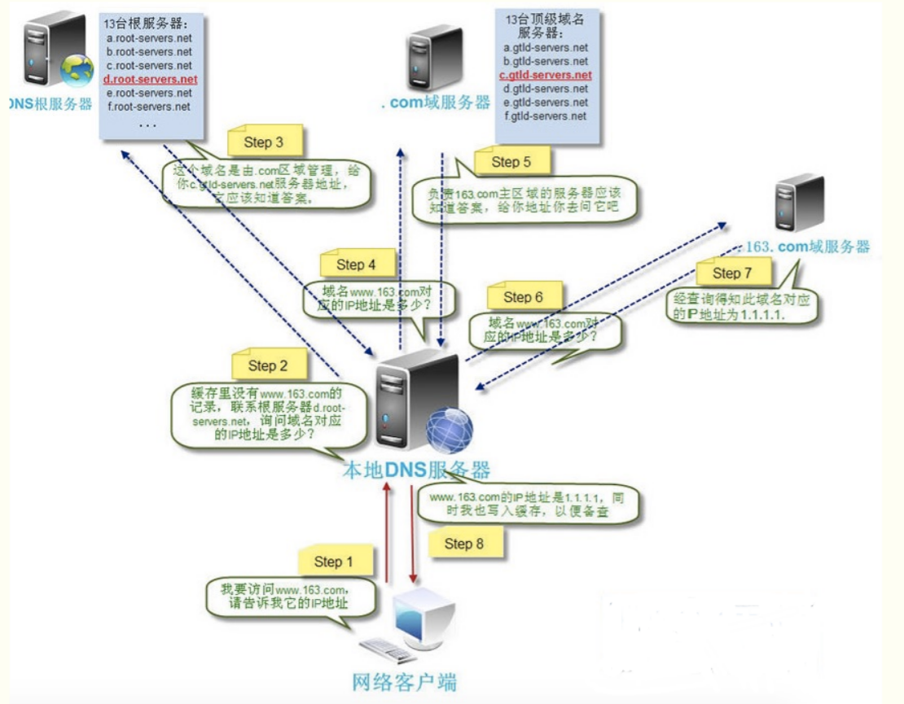

```shell
1、找本机的hosts文件 Windows host文件路径： C:\WINDOWS\system32\drivers\etc\hosts ,hosts文件以静态映射的方式提供IP地址与主机名的对照表。
2、浏览器缓存： 浏览器会按照一定的频率缓存DNS记录。浏览器地址栏输入chrome://net-internals/#dns，就可以查看chormeDNS缓存。
3、操作系统缓存： 如果浏览器缓存中找不到需要的DNS记录，那就去操作系统中找。cmd命令ipconfig /displaydns 用于查看操作系统dns缓存。ipconfig /flushdns刷新缓存，之前的记录就没了，只剩下一些固定的了。
4、路由缓存： 路由器也有DNS缓存。
5、去DNS本地服务器查找，自己公司搭建的或者阿里DNS服务器、百度DNS服务器等等
6、去根域名服务器上找，全世界有13台根域名服务器，其实我们的网址，比如www.hc39.com后面都有个点.，这个.代表根域名的意思，我们可以nslookup www.hc39.com. 发现还是可以查询到的，只不过这个.默认省略掉了。
7、根域名查不到的话，会直接下发本次请求给本地DNS服务器，并且把.com的顶级域名服务器地址发送给它，DNS服务器再向.com顶级域名服务器来进行查询。.com\.cn\.cloud等都是顶级域名服务器。
8、如果.com找不到的话，.com顶级域名服务器会给本地DNS服务器下发请求，并且给它hc39.com域名服务器的地址，意思就是说hc39这个域名下放给hc39这个域名所属公司的DNS服务器了，那么就去hc39.com域名服务器进行查询
9、查找到之后再还给你的电脑，你的电脑本地和路由器等都会自动缓存这些记录，下次再访问这个网站的时候，就从缓存中找，不然每次都按照流程找一遍就太慢了。
```

### DNS记录类型

```
A记录：域名对应一个ipv4的地址，通过dns查询这个域名就能得到对应ip地址 例如：www.wulaoban.top -- 39.105.145.132
CNAME：也叫做域名别名，它将域名指向另外一个域名，你通过这个域名来进行DNS查询，那么得到的是另外一个域名，DNS查询会基于询问另外一个域名。 比如dig www.qq.com就能看到CNAME记录
MX：邮件记录，我们发邮件给1111@qq.com这个地址，那么首先会去找qq的邮箱服务器，就需要用到这个记录来找到服务器。windows上也自带nslookup指令，查询a记录：nslookup -qt=a qq.com，查询mx记录：nslookup -qt=mx qq.com，会看到几个域名，ping域名就看到ip地址了。qq.com有mx记录，说明qq这个公司有自己的邮箱。如果某个公司没有自己的邮箱服务器，那么查不到信息。
NS：全称nameserver，可以指定DNS解析服务器的地址，在我们自己的域名解析记录上也可以设置自己DNS解析服务器，但是需要搭建DNS服务才行。
AAAA：ipv6地址
```

nslookip示例:

```
C:\Users\ls198>nslookup -qt=a qq.com
DNS request timed out.
   timeout was 2 seconds.
服务器: UnKnown
Address:  192.168.2.1
非权威应答:
名称:   qq.com
Addresses:  61.129.7.47
          183.3.226.35
          123.151.137.18
C:\Users\ls198>nslookup -qt=mx qq.com
DNS request timed out.
   timeout was 2 seconds.
服务器: UnKnown
Address:  192.168.2.1
非权威应答:
qq.com MX preference = 10, mail exchanger = mx3.qq.com
qq.com MX preference = 30, mail exchanger = mx1.qq.com
qq.com MX preference = 20, mail exchanger = mx2.qq.com
C:\Users\ls198>ping mx1.qq.com
正在 Ping mx1.qq.com [113.96.208.206] 具有 32 字节的数据:
来自 113.96.208.206 的回复: 字节=32 时间=49ms TTL=53
来自 113.96.208.206 的回复: 字节=32 时间=47ms TTL=53
来自 113.96.208.206 的回复: 字节=32 时间=49ms TTL=53
来自 113.96.208.206 的回复: 字节=32 时间=48ms TTL=53
113.96.208.206 的 Ping 统计信息:
   数据包: 已发送 = 4，已接收 = 4，丢失 = 0 (0% 丢失)，
往返行程的估计时间(以毫秒为单位):
   最短 = 47ms，最长 = 49ms，平均 = 48ms
C:\Users\ls198>nslookup -qt=mx wulaoban.top  # 没有邮箱地址
服务器: UnKnown
Address:  192.168.2.1
wulaoban.top
       primary name server = dns19.hichina.com
       responsible mail addr = hostmaster.hichina.com
       serial  = 2022052002
       refresh = 3600 (1 hour)
       retry   = 1200 (20 mins)
       expire  = 86400 (1 day)
       default TTL = 600 (10 mins)
C:\Users\ls198>nslookup -qt=AAAA aliyun.com
DNS request timed out.
   timeout was 2 seconds.
服务器: UnKnown
Address:  192.168.2.1
非权威应答:
名称:   aliyun.com
Addresses:  2401:b180:1:60::5
          2401:b180:1:60::6
```

## ARP

ARP（Address Resolution Protocol），工作在网络层和数据链路层中间。osi七层模型中，属于数据链路基层的。

作用：把ip地址解析成mac地址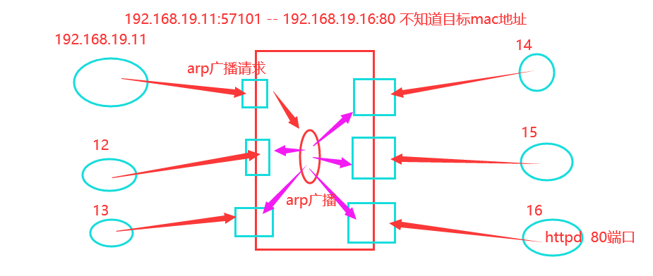

### ARP 工作流程

### **（1）检查ARP缓存**

- 主机A先查询本地 **ARP缓存表**（存储IP-MAC映射），若找到目标IP对应的MAC，直接通信。

  ```
  # 查看ARP缓存（Windows/Linux通用）
  arp -a
  ```

### **（2）发送ARP请求（广播）**

- 若缓存无记录，主机A发送 **ARP请求包**（广播）：

  - **源MAC**：主机A的MAC
  - **源IP**：主机A的IP（如 `192.168.1.10`）
  - **目标MAC**：`FF:FF:FF:FF:FF:FF`（全1广播地址）
  - **目标IP**：主机B的IP（如 `192.168.1.20`）
  - **报文类型**：`ARP Request`

  ```
  Ethernet Header:
    Destination: FF:FF:FF:FF:FF:FF
    Source:      AA:AA:AA:AA:AA:AA (主机A)
  ARP Payload:
    Sender MAC: AA:AA:AA:AA:AA:AA
    Sender IP:  192.168.1.10
    Target MAC: 00:00:00:00:00:00 (未知)
    Target IP:  192.168.1.20
  ```

### **（3）目标主机响应（单播）**

- 主机B收到ARP请求后：

  1. 发现目标IP是自己，记录主机A的IP-MAC到本地ARP缓存。
  2. 向主机A发送 **ARP响应包**（单播）：
     - **源MAC**：主机B的MAC
     - **目标MAC**：主机A的MAC
     - **报文类型**：`ARP Reply`

  ```
  Ethernet Header:
    Destination: AA:AA:AA:AA:AA:AA (主机A)
    Source:      BB:BB:BB:BB:BB:BB (主机B)
  ARP Payload:
    Sender MAC: BB:BB:BB:BB:BB:BB
    Sender IP:  192.168.1.20
    Target MAC: AA:AA:AA:AA:AA:AA
    Target IP:  192.168.1.10
  ```

### **（4）更新ARP缓存**

- 主机A收到ARP响应后：
  1. 记录主机B的IP-MAC映射到ARP缓存。
  2. 开始正常通信（如ICMP Ping）。

## VMware虚拟机中的三种网络模式

```
桥接模式(bridged)：也就是将虚拟机的虚拟网络适配器与主机的物理网络适配器进行交接，虚拟机中的虚拟网络适配器可通过主机中的物理网络适配器直接访问到外部网络。简而言之，这就好像在局域网中添加了一台新的、独立的计算机一样。因此，虚拟机也会占用局域网中的一个 IP 地址，并且可以和其他终端进行相互访问。桥接模式网络连接支持有线和无线主机网络适配器。如果你想把虚拟机当做一台完全独立的计算机看待，并且允许它和其他终端一样的进行网络通信，那么桥接模式通常是虚拟机访问网络的最简单途径。
NAT模式：是Network Address Translation的缩写，意即网络地址转换。NAT 模式也是 VMware 创建虚拟机的默认网络连接模式。使用NAT模式网络连接时，VMware会在主机上建立单独的专用网络，用以在主机和虚拟机之间相互通信。虚拟机向外部网络发送的请求数据 "包裹"，都会交由 NAT 网络适配器加上 "特殊标记" 并以主机的名义转发出去，外部网络返回的响应数据 "包裹"，也是先由主机接收，然后交由 NAT 网络适配器根据 "特殊标记" 进行识别并转发给对应的虚拟机，因此，虚拟机在外部网络中不必具有自己的IP地址。从外部网络来看，虚拟机和主机在共享一个IP地址，默认情况下，外部网络终端也无法访问到虚拟机。
仅主机模式(host-only)：是一种比 NAT 模式更加封闭的的网络连接模式，它将创建完全包含在主机中的专用网络。仅主机模式的虚拟网络适配器仅对主机可见，并在虚拟机和主机系统之间提供网络连接。相对于 NAT 模式而言，仅主机模式不具备 NAT 功能，因此在默认情况下，使用仅主机模式网络连接的虚拟机无法连接到Internet (在主机上安装合适的路由或代理软件，或者在 Windows 系统的主机上使用 Internet 连接共享功能，仍然可以让虚拟机连接到 Internet 或其他网络)。在同一台主机上可以创建多个仅主机模式的虚拟网络，如果多个虚拟机处于同一个仅主机模式网络中，那么它们之间是可以相互通信的；如果它们处于不同的仅主机模式网络，则默认情况下无法进行相互通信（可通过在它们之间设置路由器来实现相互通信）。
```

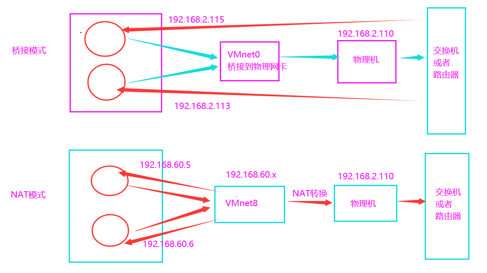

仅主机模式下的虚拟机是不能上网的，单纯的是物理机的奴隶，同一个虚拟网络的仅主机模式的虚拟机之间是可以互相通信的。和主机可以通信吗？这个要看网段配置，如果虚拟机和主机在同一个网段是可以通信的，如果不是也不能通信，而且仅主机模式的虚拟机只能和本主机通信，不能和主机同一网络或者公网的其他主机通信。

 对应网卡：桥接模式用的VMnet0网卡，不显示，因为它只起一个桥接到物理网卡的作用，这个就是直接找的我们物理机的网卡，所以不用管它。

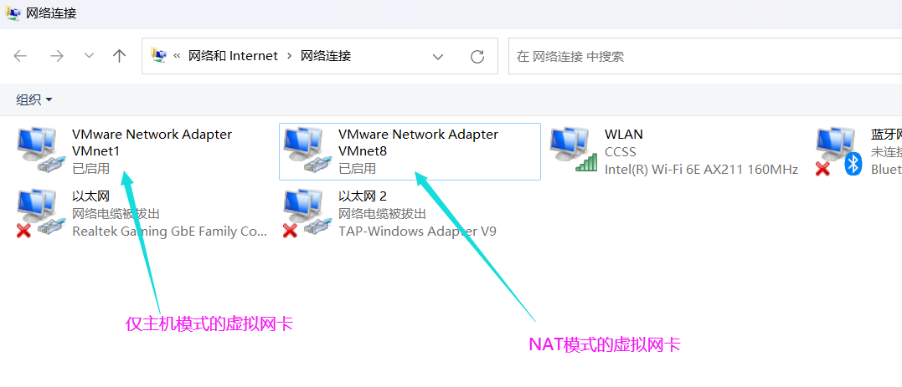

### linux静态ip配置

linux配置ip地址和windows不一样，不是点点点就能搞定的，需要修改配置文件。

我们在虚拟机中配置双网卡，我们来改一下第一块网卡ens33的配置，指定为固定ip地址。然后再改一下第二块网卡信息。

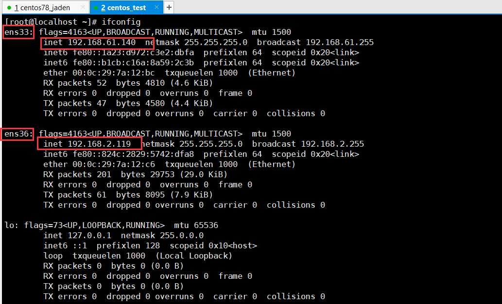

但是当我们查看网卡配置信息的时候，会发现配置文件只有ifcfg-ens33，如下

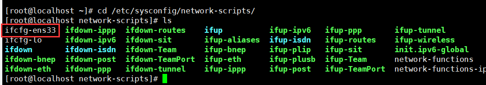

我们给ens36也弄个配置文件，需要复制一份ifcfg-ens33配置文件，然后改名为ifcfg-ens36。

然后修改ifcfg-ens33配置信息, 改为如下内容：配置文件路径/etc/sysconfig/network-scripts/ifcfg-ens33

```shell
#默认配置
TYPE="Ethernet"  # 类型：以太网，我们现在用的网络都是以太网，数据链路基层都是以太网协议，没有别的协议。1982年以太网统一了链路层的协议.
PROXY_METHOD="none"# 代理方法，目前无用，删除
BROWSER_ONLY="no"# 只允许浏览器使用，没用，删除
BOOTPROTO="dhcp"  # 获取ip地址的方法，目前是dhcp，改为static，静态指定ip地址。
DEFROUTE="yes"# 默认路由，没用，删除
IPV4_FAILURE_FATAL="no"# 从这一行开始开始，往下数6行，都删掉
IPV6INIT="yes"
IPV6_AUTOCONF="yes"
IPV6_DEFROUTE="yes"
IPV6_FAILURE_FATAL="no"
IPV6_ADDR_GEN_MODE="stable-privacy"
NAME="ens33"  # 名字改为ens36
UUID="15723721-cab7-40f6-bcee-4789906f8661"# 这是唯一标识符，这个没用，删掉
DEVICE="ens33"
ONBOOT="yes"
#修改后的配置
TYPE="Ethernet"        #以太网类型
BOOTPROTO="static"     #dhcp自动获取 none,static手动配置
NAME="ens33"           #网络的名字
DEVICE="ens33"         #网卡的名字
ONBOOT="yes"           #开机自启
IPADDR=192.168.61.150   #ip地址
NETMASK=255.255.255.0  #子网掩码
# 其实下面网卡和dns都可以不用配置，因为我有两块网卡，只要有一块网卡有了下面网卡等的配置即可。
# GATEWAY=192.168.61.2  #网关
# DNS1=223.5.5.5         #dns1
# DNS2=180.76.76.76      #dns2
```

我们修改一下第二块网卡ens36的信息

```shell
#修改后的配置
TYPE="Ethernet"        #以太网类型
BOOTPROTO="static"     #dhcp自动获取 none,static手动配置
NAME="ens36"           #网络的名字
DEVICE="ens36"         #网卡的名字
ONBOOT="yes"           #开机自启
IPADDR=192.168.2.110   #ip地址
NETMASK=255.255.255.0  #子网掩码
# 其实下面网卡和dns都可以不用配置，因为我有两块网卡，只要有一块网卡有了下面网卡等的配置即可。
GATEWAY=192.168.2.1    #网关  # 这个就看我们物理机的网关ip即可，不管有几块网卡，指定一个网关即可。
DNS1=223.5.5.5         #dns1
DNS2=180.76.76.76      #dns2
```

修改完配置文件，重启网络服务生效

```shell
systemctl restart network  # 刚改完配置，重启可能会卡住一会
systemctl stop NetworkManager
systemctl disable NetworkManager
```

## 网络工具

### nmap

这个工具主要是做信息收集用的，后面安全课程和工作中都用的比较多，也叫做主机安全扫描器，探测主机存活、端口开放情况所用的工具，这个工具我们后面安全课程中还会细讲，这里先简单说一下：官\网地址为https://nmap.org/

```shell
# centos7上安装nmap
yum install nmap -y
[root@localhost ~]# nmap -v # 默认安装的6.40，不是最新版本，yum经常是下载不了最新版的，有
镜像更新延迟的问题
Starting Nmap 6.40 ( http://nmap.org ) at 2023-04-05 00:13 CST
...
# 官网下载最新版本的rpm包，然后rpm安装即可
# rpm -Uvh nmap-7.93-1.x86_64.rpm # -U表示升级，如果已经安装了低版本就用-Uvh，如果没有安装老版本，那么-ivh安装
# nmap -sn 192.168.61.0/24
# 探测主机哪些端口开放
[root@localhost ~]# nmap -sS 192.168.61.0/24 # ip地址段
[root@localhost ~]# nmap -sS 192.168.61.139 # 单个ip地址
# 如果你的主机在公网上面，别人通过nmap直接就可以扫描你，如果发现有什么漏洞，直接就可以把你拿下。
```

### traceroute和tracert

这两个工具是进行路由追踪的，router是路由的意思，路由追踪的意思就是查看一下我们想访问某个网站到底会经历哪些设备地址的跳转。这个用的不是很多。

tracert是windows上自带的工具：

```shell
C:\Users\ls198>tracert -d nmap.org # 比如追踪一下nmap.org，这是国外的网站，所以数据包应
该是出国了。
通过最多 30 个跃点跟踪
到 nmap.org [45.33.49.119] 的路由:
守夜人Jaden-吴老板
traceroute是linux上的工具，需要安装一下
中国最大的防火墙，是GWF中国长城防火墙，就在国际网络出口位置进行网络进出的控制和监控。大家
可以百度看一下GWF的作用。
十三、修改网络配置
1、VMware虚拟机的三种网络模式
  1     3 ms   109 ms     6 ms  192.168.2.1  # 路由
  2     *        9 ms     4 ms  192.168.1.1  # 光猫
  3    42 ms    51 ms    12 ms  10.29.0.1    # 电信局域网
  4     *       *       *     请求超时。
  5     *       *      198 ms  27.129.33.225 # 廊坊电信网络机房等
  6     *       *       *     请求超时。
  7     *       *       *     请求超时。
  8     *       *       28 ms  202.97.54.14 # 天津电信
  9   254 ms   197 ms   205 ms  202.97.59.106 # 天津电信
10     *       *       *     请求超时。
11   181 ms   181 ms   189 ms  154.54.5.101 # 美国 加利福尼亚州 圣何塞
12   185 ms   190 ms   183 ms  154.54.3.138 # 美国 加利福尼亚州 圣何塞
13   185 ms   190 ms   189 ms  38.142.11.154 # 美国 加利福尼亚州 圣何塞
14     *       *       *     请求超时。
15   187 ms   195 ms     *     45.33.49.119 # 美国 加利福尼亚州 弗里蒙特
16  1027 ms   565 ms   179 ms  45.33.49.119 # 美国 加利福尼亚州 弗里蒙特
跟踪完成。
```

traceroute是linux上的工具，需要安装一下

```shell
# 安装
[root@localhost ~]# yum provides traceroute
[root@localhost ~]# yum install traceroute -y
[root@localhost ~]# traceroute -n nmap.org
# 这个工具不好用，总是查询超时，查不到数据
```

